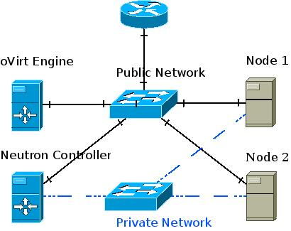

================================
附录一 
================================

这里我会使用RDO快速部署一个具有基本功能的OpenStack环境，如果你想要更完整的部署（比如Heat、Trove组件），可以参考 `官方文档 <http://docs.openstack.org/icehouse/install-guide/install/yum/content>`_ 。

要学习更多关于OpenStack的内容，可以参考 `陈沙克的日志 <http://www.chenshake.com/cloud-computing/>`_ 。

API使用请参考http://developer.openstack.org/api-ref.html 以及 http://docs.openstack.org/developer/openstack-projects.html 。

---------------------
OpenStack RDO快速部署
---------------------

在开始之前需要将这些关键组件关系理清。

- nova：提供compute服务，即保证虚拟机运行的必须服务之一，虚拟机运行于所有提供compute服务的主机之上。

- neutron：提供network服务，同时提供Open vSwitch、L3、DHCP代理服务。

- cinder：提供块存储服务，配合swift使用。

- swift：提供对象存储服务，目录与文件皆视为对象，外部可以方便取用。

- glance：提供镜像管理服务。

- ceilometer：主要功能是监测、收集用户对资源的使用情况，以方便计费等。

- heat：用于模板化部署的服务。

- keystone：身份认证服务。

RDO快速部署
------------

使用 `RDO <http://openstack.redhat.com/Main_Page>`_ 来部署OpenStack。

.. note:: **安装说明**

    在一台安装有RedHat系列（CentOS）系统上部署，将selinux置为permissive；禁用NetworkManager，启用network服务，详细配置请参考以前章节。

.. code::

    # yum install -y http://rdo.fedorapeople.org/rdo-release.rpm
    # yum update -y
    # yum install -y openstack-packstack
    # packstack --allinone

请耐心等待，以上过程预计花费一到两小时。有关此次部署的详细信息，在安装完成后可以看到：

.. code::

     **** Installation completed successfully ******

     Additional information:
     * A new answerfile was created in: /root/packstack-answers-20140730-110621.txt
     * Time synchronization installation was skipped. Please note that unsynchronized time on server instances might be problem for some OpenStack components.
     * File /root/keystonerc_admin has been created on OpenStack client host 192.168.2.160. To use the command line tools you need to source the file.
     * To access the OpenStack Dashboard browse to http://192.168.2.160/dashboard .
     Please, find your login credentials stored in the keystonerc_admin in your home directory.
     * To use Nagios, browse to http://192.168.2.160/nagios username: nagiosadmin, password: ea65dc070f034776
     * Because of the kernel update the host 192.168.2.160 requires reboot.
     * The installation log file is available at: /var/tmp/packstack/20140730-110621-upxlZJ/openstack-setup.log
     * The generated manifests are available at: /var/tmp/packstack/20140730-110621-upxlZJ/manifests

可修改 */root/packstack-answers-20140730-110621.txt* 内容以 `增加计算节点 <http://openstack.redhat.com/Adding_a_compute_node>`_ ；同理可增加网络节点（待实验）。

.. note::

    假如更换了admin/demo/services的密码，不要忘记在此配置文件中将其修改为新密码。
    # packstack --answer-file=/root/packstack-answers-20140730-110621.txt

添加镜像
---------

以admin或者demo用户身份登录dashboard后，选择“镜像”，上传ISO。

.. image:: ../images/apx01-01.png
    :align: center
    

从ISO安装新实例
----------------

在“实例”选项卡中，选择“添加实例”，并从现有镜像启动。

.. image:: ../images/apx01-02.png
    :align: center

oVirt使用Glance与Neutron服务
-----------------------------

oVirt自3.3版本起，便可以添加外部组件，比如Foreman、OpenStack的网络或镜像服务。

在添加OpenStack相关组件之前，oVirt管理端需要配置OpenStack的KeyStone URL：

.. code::

    # engine-config --set KeystoneAuthUrl=http://192.168.2.160:35357/v2.0
    # service ovirt-engine restart

添加OpenStack镜像服务Glance至oVirt
~~~~~~~~~~~~~~~~~~~~~~~~~~~~~~~~~~~~

1. 在OpenStack的控制台中，添加一个新镜像，比如my_test_image，格式为raw。

.. image:: ../images/apx01-03.png
    :align: center

2. 在oVirt左边栏，选择External Provider添加OpenStack Image服务。

.. image:: ../images/apx01-04.png
    :align: center

.. note:: 认证选项

    用户名：glance

    密码：存于RDO配置文件中，形如 CONFIG_GLANCE_KS_PW=bf83b75a635843b4

    Tenant：services

3. 然后可以在oVirt的存储域中看到刚刚添加的Glance服务。

.. image:: ../images/apx01-05.png
    :align: center

Neutron
~~~~~~~

可参考 `NeutronVirtualAppliance <http://www.ovirt.org/Features/NeutronVirtualAppliance>`_ 以及 `Overlay_Networks_with_Neutron_Integration <http://www.ovirt.org/Overlay_Networks_with_Neutron_Integration>`_ 。

1. 配置oVirt。
   
.. code::

    # engine-config --set OnlyRequiredNetworksMandatoryForVdsSelection=true
    # yum install vdsm-hook-openstacknet
    # service ovirt-engine restart

2. 如图添加Neutron组件。

.. image:: ../images/apx01-07.png
    :align: center

.. image:: ../images/apx01-08.png
    :align: center

.. note:: 认证选项

    用户名：neutron

    密码：存于RDO配置文件中，形如 CONFIG_NEUTRON_KS_PW=a16c52e3ea634324

    Tenant：services

    agent 配置相同

OpenStack常见问题集锦
~~~~~~~~~~~~~~~~~~~~~

Q：Swift不能删除目录。

A：使用命令 swift delete public_container aaa/ 进行删除。

Q： Neutron 网络快速开始？

A：参考https://www.ustack.com/blog/neutron_intro/

Q：OpenStack组件间的通信是靠什么？

A：AMQP，比如RabbitMQ、Apache的ActiveMQ，部署时候可以选择，如果对这种消息传输工具有兴趣可以参考 `rabbitmq tutorial <http://www.rabbitmq.com/getstarted.html>`_ 以及 `各种有用的插件（web监视等） <http://www.rabbitmq.com/plugins.html>`_ 。

----------------
SDN学习/mininet
----------------

现代SDN来自OpenFlow，关于SDN有一个个人认为最佳的学习工具： `mininet <http://mininet.org>`_ 。

-----------------
常用性能测量工具
-----------------

- CPU：SPEC、UNIXbench、SuperPI、PCMark

- 图形：3dmark

- 磁盘：hdparm、iozone、blogbench、dbench

- ram：ramspeed

------------
常用运维工具
------------

zabbix
-------

类似Nagios，不过图形绘制很强，在一键脚本中提供安装。

`移动客户端下载 <http://www.zabbix.com/third_party_tools.php>`_  。

关于zabbix的更多介绍可以参考 `itnihao的相关著作 <http://www.zhihu.com/question/19973178>`_ 。

nagios
-------

使用UI Plugin可以将在oVirt管理界面中查看Nagios监控状态，可参考 `oVirt_Monitoring_UI_Plugin <http://www.ovirt.org/Features/UIPlugins#oVirt_Monitoring_UI_Plugin>`_ 以及 `Nagios_Intergration <http://www.ovirt.org/Features/Nagios_Integration>`_ 。

foreman
--------

使用Foreman的主要目的是更方便地部署宿主机以及创建虚拟机。

参考 `ForemanIntegration <http://www.ovirt.org/Features/ForemanIntegration>`_ 、 `foreman_ovirt <https://github.com/oourfali/foreman_ovirt>`_ 以及UIPlugin相关内容。

chef
----

简单理解为一些列安装脚本（cookbook）。

访问 `http://gettingstartedwithchef.com/ <http://gettingstartedwithchef.com/first-steps-with-chef.html>`_ 开始快速上手学习。

`获取更多cookbook <https://supermarket.getchef.com/cookbooks-directory>`_ 。

puppet
------

功能上与chef类似，但是影响力更大。

`下载虚拟机 <https://puppetlabs.com/download-learning-vm>`_ 并按照里面的教程来快速上手。
