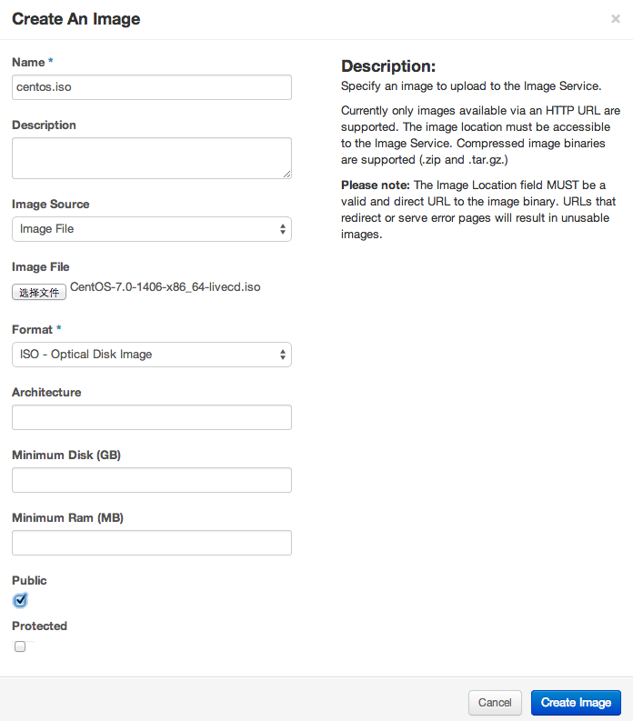
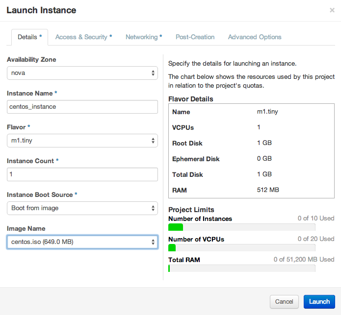
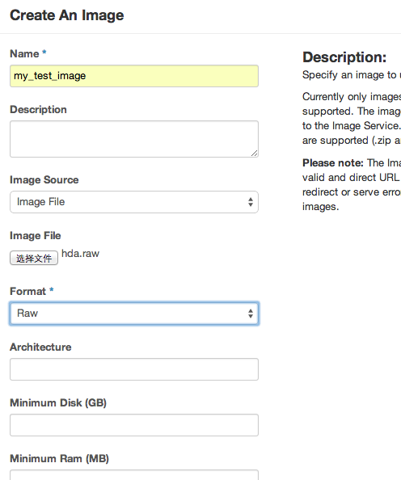
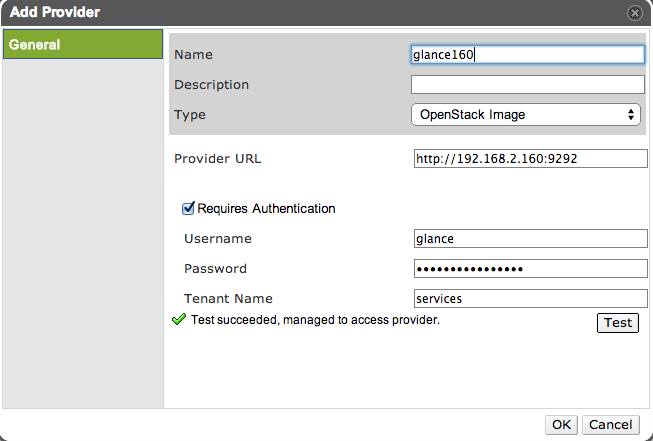
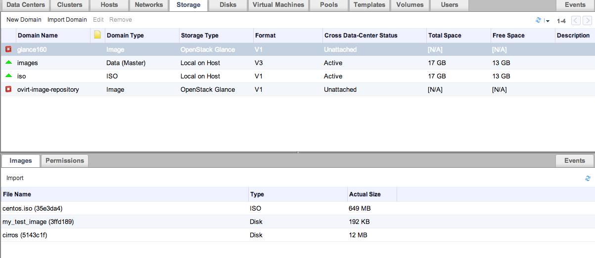

================================
附录一 OpenStack及常用运维工具
================================

--------------------------
OpenStack/Neutron快速搭建
--------------------------

在开始之前先把这些OpenStack的关键组件关系理清吧。

**nova**

    提供compute服务，即保证虚拟机运行的必须服务之一，虚拟机运行于所有提供compute服务的主机之上。

**neutron**

    提供network服务，同时提供Open vSwitch、L3、DHCP代理服务。

**cinder**

    提供块存储服务，配合swift使用。

**swift**

    提供对象存储服务，目录与文件皆视为对象，外部可以方便取用。

**glance**

    提供镜像管理服务。

**ceilometer**

    主要功能是监测、收集用户对资源的使用情况，以方便计费等。

**heat**

    用于模板化部署的服务。

**keystone**

    身份认证服务。

RDO快速部署
------------

使用 `RDO <http://openstack.redhat.com/Main_Page>`_ 来部署OpenStack。

.. note:: **安装说明**

    建议在一台安装有RedHat系列（CentOS）系统上部署，将selinux置为permissive；禁用NetworkManager，启用network服务，详细配置请参考以前章节。

.. code::

    sudo yum update -y
    sudo yum install -y http://rdo.fedorapeople.org/rdo-release.rpm
    sudo yum install -y openstack-packstack
    sudo packstack --allinone

请耐心等待，以上过程预计花费一到两小时。有关此次部署的详细信息，在安装完成后可以看到：

.. code::

     **** Installation completed successfully ******

     Additional information:
     * A new answerfile was created in: /root/packstack-answers-20140730-110621.txt
     * Time synchronization installation was skipped. Please note that unsynchronized time on server instances might be problem for some OpenStack components.
     * File /root/keystonerc_admin has been created on OpenStack client host 192.168.2.160. To use the command line tools you need to source the file.
     * To access the OpenStack Dashboard browse to http://192.168.2.160/dashboard .
     Please, find your login credentials stored in the keystonerc_admin in your home directory.
     * To use Nagios, browse to http://192.168.2.160/nagios username: nagiosadmin, password: ea65dc070f034776
     * Because of the kernel update the host 192.168.2.160 requires reboot.
     * The installation log file is available at: /var/tmp/packstack/20140730-110621-upxlZJ/openstack-setup.log
     * The generated manifests are available at: /var/tmp/packstack/20140730-110621-upxlZJ/manifests

可修改 */root/packstack-answers-20140730-110621.txt* 内容以 `增加计算节点 <http://openstack.redhat.com/Adding_a_compute_node>`_ ；同理可增加网络节点（待实验）。

添加镜像
---------

以admin或者demo用户身份登录dashboard后，选择“镜像”，上传ISO。

    

从ISO安装新实例
----------------

在“实例”选项卡中，选择“添加实例”，并从现有镜像启动。

oVirt使用Glance与Neutron服务
-----------------------------

oVirt自3.3版本起，便可以添加外部组件，比如Foreman、OpenStack的网络或镜像服务。

在添加OpenStack相关组件之前，oVirt管理端需要配置OpenStack的KeyStone URL：

.. code::

    # engine-config --set KeystoneAuthUrl=http://192.168.2.160:35357/v2.0
    # service ovirt-engine restart

添加OpenStack镜像服务Glance至oVirt
~~~~~~~~~~~~~~~~~~~~~~~~~~~~~~~~~~~~

1. 在OpenStack的控制台中，添加一个新镜像，比如my_test_image，格式为raw。

2. 在oVirt左边栏，选择External Provider添加OpenStack Image服务。

.. note:: 认证选项

    用户名：glance
    密码：存于RDO配置文件中，形如 CONFIG_GLANCE_KS_PW=bf83b75a635843b4
    Tenant：services

3. 然后可以在oVirt的存储域中看到刚刚添加的Glance服务。

Neutron
~~~~~~~

----------------
SDN学习/mininet
----------------

-----------------
常用性能测量工具
-----------------

------------
常用运维工具
------------

nagios
-------

foreman
--------

chef 自动化部署
----------------
