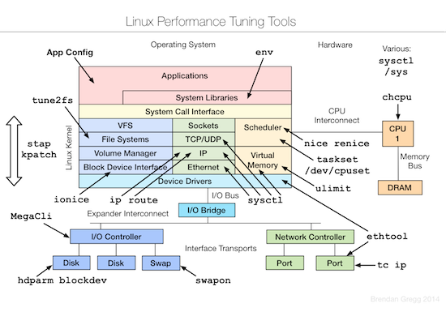
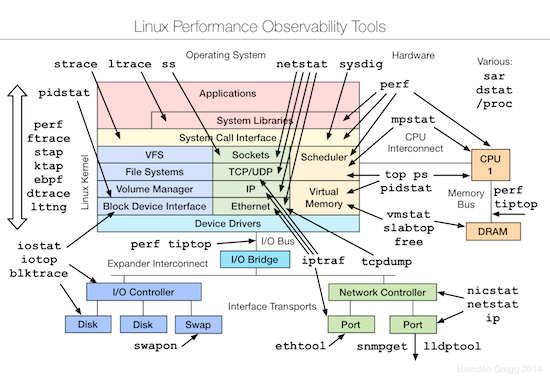
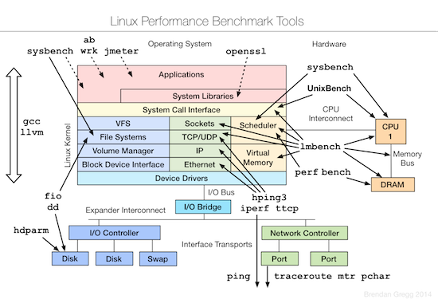

========================
附录五 常用功能运维工具
========================

-----------------
Foreman 部署指导
-----------------

-----------------
Katello 部署指导
-----------------

-------------
数据恢复工具
-------------

extundelete

-----------------------
常用性能测量及优化工具
-----------------------

- 优化

- 监视

- 测试

all in one - pip install glances

另外针对qemu/libvirt相关的测试工具，可以参考 `virt-test <https://github.com/autotest/virt-test>`_ ，当然，仅作参考。

----------------
HAProxy
----------------

没错，我就是要把这个东西单列出来讲，因为你可以用这个东西来做几乎全部应用的HA或者LoadBalancer， `这里是配置说明 <http://www.haproxy.org/download/1.4/doc/configuration.txt>` 。

代理http:

.. code::

    ...

    backend webbackend
        balance roundrobin
        server web1 192.168.0.130:80 check

    frontend http
        bind *:80
        mode http
        default_backend webbackend

    listen  stats :8080
        balance
        mode http
        stats enable
        stats auth me:password

代理tcp:

.. code::

    listen *:3306
        mode tcp
        option tcplog
        balance roundrobin
        server smtp 192.168.0.1:3306 check
        server smtp1 192.168.0.2:3306 check

------------
常用运维工具
------------

Monit
-----

小型监控工具，不推荐使用。

Munin
-----

轻量级的监控工具。

Cacti
-----

与Zabbix在某些方面很像。

Ganglia
--------

比较专业的监控工具，并有一款专门针对虚拟机的应用。
http://blog.sflow.com/2012/01/using-ganglia-to-monitor-virtual.html

zabbix
-------

类似Nagios，不过图形绘制很强，在一键脚本中提供安装。

`移动客户端下载 <http://www.zabbix.com/third_party_tools.php>`_  。

关于zabbix的更多介绍可以参考 `itnihao的相关著作 <http://www.zhihu.com/question/19973178>`_ 。

nagios
-------

使用UI Plugin可以将在oVirt管理界面中查看Nagios监控状态，可参考 `oVirt_Monitoring_UI_Plugin <http://www.ovirt.org/Features/UIPlugins#oVirt_Monitoring_UI_Plugin>`_ 以及 `Nagios_Intergration <http://www.ovirt.org/Features/Nagios_Integration>`_ 。

foreman
--------

使用Foreman的主要目的是更方便地部署宿主机以及创建虚拟机。

参考 `ForemanIntegration <http://www.ovirt.org/Features/ForemanIntegration>`_ 、 `foreman_ovirt <https://github.com/oourfali/foreman_ovirt>`_ 以及UIPlugin相关内容。

chef
----

简单理解为一些列安装脚本（cookbook）。

访问 `http://gettingstartedwithchef.com/ <http://gettingstartedwithchef.com/first-steps-with-chef.html>`_ 开始快速上手学习。

`获取更多cookbook <https://supermarket.getchef.com/cookbooks-directory>`_ 。

puppet
------

功能上与chef类似，但是影响力更大。

`下载虚拟机 <https://puppetlabs.com/download-learning-vm>`_ 并按照里面的教程来快速上手。
