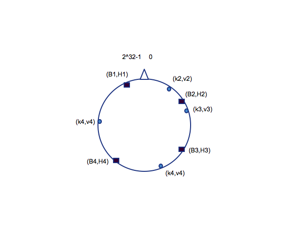
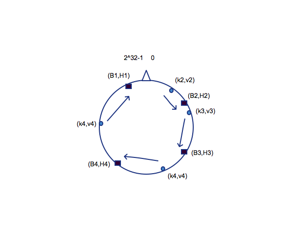
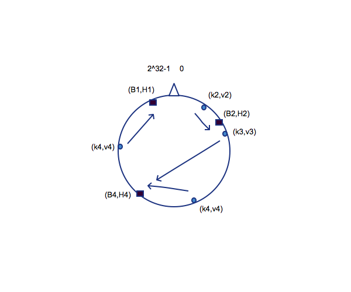
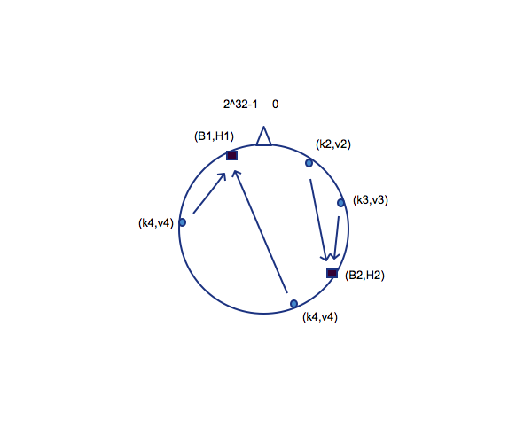

==========================
第二章 一个可靠的存储后端
==========================

-------------------
2.1 谈谈分布式存储
-------------------

计算机领域中有诸多有意思的东西可以把玩，在这儿且看看分布式存储。

**集群文件系统** 

在某些场景下又可以称作网络文件系统、并行文件系统，在70年代由IBM提出并实现原型。

有几种方法可以实现集群形式，但多数仅仅是节点直连存储而不是将存储之上的文件系统进行合理“分布”。分布式文件系统同时挂载于多个服务器上，并在它们之间共享，可以提供类似于位置无关的数据定位或冗余等特点。并行文件系统是一种集群式的文件系统，它将数据分布于多个节点，其主要目的是提供冗余和提高读写性能。

**共享磁盘（Shared-disk）/Storage-area network(SAN)**

从应用程序使用的文件级别，到SAN之间的块级别的操作，诸如权限控制和传输，都是发生在客户端节点上。共享磁盘（Shared-disk）文件系统，在并行控制上做了很多工作，以至于其拥有比较一致连贯的文件系统视图，从而避免了多个客户端试图同时访问同一设备时数据断片或丢失的情况发生。其中有种技术叫做围栏（Fencing），就是在某个或某些节点发生断片时，集群自动将这些节点隔离（关机、断网、自恢复），保证其他节点数据访问的正确性。元数据（Metadata）类似目录，可以让所有的机器都能查找使用所有信息，在不同的架构中有不同的保存方式，有的均匀分布于集群，有的存储在中央节点。

实现的方式有iSCSI，AoE，FC，Infiniband等，比较著名的产品有Redhat GFS、Sun QFS、Vmware VMFS等。

**分布式文件系统**

分布式文件系统则不是块级别的共享的形式了，所有加进来的存储（文件系统）都是整个文件系统的一部分，所有数据的传输也是依靠网络来的。

它的设计有这么几个原则：

- *访问透明* 客户端在其上的文件操作与本地文件系统无异

- *位置透明* 其上的文件不代表其存储位置，只要给了全名就能访问

- *并发透明* 所有客户端持有的文件系统的状态在任何时候都是一致的，不会出现A修改了F文件，但是B愣了半天才发现。

- *失败透明* 理解为阻塞操作，不成功不回头。

- *异构性* 文件系统可以在多种硬件以及操作系统下部署使用。

- *扩展性* 随时添加进新的节点，无视其资格新旧。

- *冗余透明* 客户端不需要了解文件存在于多个节点上这一事实。

- *迁移透明* 客户端不需要了解文件根据负载均衡策略迁移的状况。

实现的方式有NFS、CIFS、SMB、NCP等，比较著名的产品有Google GFS、Hadoop HDFS、GlusterFS、Lustre等。

.. epigraph::

    FUSE，filesystem in user space。

    FUSE全名Filesystem in Userspace，是在类UNIX系统下的一个机制，可以让普通用户创建修改访问文件系统。功能就是连接内核接口与用户控件程序的一座“桥”，目前普遍存在于多个操作系统中，比如Linux、BSD、Solaris、OSX、Android等。

    FUSE来源于AVFS，不同于传统文件系统从磁盘读写数据，FUSE在文件系统或磁盘中有“转换”的角色，本身并不会存储数据。

    在Linux系统中的实现有很多，比如各种要挂载ntfs文件系统使用到的ntfs-3g，以及即将要用到的glusterfs-fuse。

.. image:: ../images/02-01.png
    :align: center

---------------------
2.2 Glusterfs简述
---------------------

接下来，说一下我所看到的glusterfs。

首先它可以基于以太网或者Infiniband构建大规模分布式文件系统，其设计原则符合奥卡姆剃刀原则，即“ *若无必要，勿增实体* ”；它的源码部分遵循GPLv3，另一部分遵循GPLv2/LGPLv3；统一对象视图，与UNIX设计哲学类似，所有皆对象；跨平台兼容性高，可作为hadoop、openstack、ovirt、Amazon EC的后端。

.. image:: ../images/02-02.png
    :align: center

.. note::

    **砖块（brick）**：即服务器节点上导出的一个目录，作为glusterfs的最基本单元。

    **卷（volume）**：用户最终使用的、由砖块组成的逻辑卷。

    **GFID**：glusterfs中的每一个文件或者目录都有一个独立的128位GFID，与普通文件系统中的inode类似。

    **节点（peer）**：即集群中含有砖块并参与构建卷的计算机。

功能介绍
---------

具体功能特性请参考 `Glusterfs features <http://gluster.readthedocs.org/en/latest/>`_ 。

组合方式
---------

**gluster支持四种存储逻辑卷组合：普通分布式（Distributed）、条带（Striped）、冗余（Replicated）、条带冗余（Striped-Replicated）**

    +-----------+-------------------------------+
    |普通分布式 |.. image:: ../images/02-04.png |
    |           |   :align: center              |
    +-----------+-------------------------------+
    |条带       |.. image:: ../images/02-05.png |
    |           |   :align: center              |
    +-----------+-------------------------------+
    | 冗余      |.. image:: ../images/02-06.png |
    |           |   :align: center              |
    +-----------+-------------------------------+
    |条带冗余   |.. image:: ../images/02-07.png |
    |           |   :align: center              |
    +-----------+-------------------------------+

Translator
----------

Translator是glusterfs设计时的核心之一，它具有以下功能：

- 将用户发来的请求转化为对存储的请求，可以是一对一、一对多或者一对零（cache）。

- 可用修改请求类型、路径、标志，甚至是数据（加密）。

- 拦截请求（访问控制）。

- 生成新请求（预取）。

**类型**

根据translator的类型，可用将其分为如下类型：

    +-----------------+-----------------------------------------+
    |Translator 类型  |功能                                     |  
    +=================+=========================================+
    |Storage          |访问本地文件系统。                       |
    +-----------------+-----------------------------------------+
    |Debug            |提供调试信息。                           |
    +-----------------+-----------------------------------------+
    |Cluster          |处理集群环境下读写请求。                 |
    +-----------------+-----------------------------------------+
    |Encryption       |加密/解密传送中的数据。                  |
    +-----------------+-----------------------------------------+
    |Protocol         |加密/解密传送中的数据。                  |
    +-----------------+-----------------------------------------+
    |Performance      |IO参数调节。                             |
    +-----------------+-----------------------------------------+
    |Bindings         |增加可扩展性，比如python接口。           |
    +-----------------+-----------------------------------------+
    |System           |负责系统访问，比如文件系统控制接口访问。 |
    +-----------------+-----------------------------------------+
    |Scheduler        |调度集群环境下文件访问请求。             |
    +-----------------+-----------------------------------------+
    |Features         |提供额外文件特性，比如quota，锁机制等。  |
    +-----------------+-----------------------------------------+

AFR
---

AFR（Automatic File Replication）是translator的一种，它使用额外机制去控制跟踪文件操作，用于跨砖块复制数据。

支持跨网备份

    +-----------+-------------------------------+
    |局域网备份 |.. image:: ../images/02-08.png |
    |           |   :align: center              |
    +-----------+-------------------------------+
    |内网备份   |.. image:: ../images/02-09.png |
    |           |   :align: center              |
    +-----------+-------------------------------+
    |广域网备份 |.. image:: ../images/02-10.png |
    |           |   :align: center              |
    +-----------+-------------------------------+

其中，它有以下特点：

- 保持数据一致性

- 发生脑裂时自动恢复，应保证至少一个节点有正确数据

- 为读系列操作提供最新数据结构

DHT
---

DHT（Distributed Hash Table）是glusterfs的真正核心。它决定将每个文件放置至砖块的位置。不同于多副本或者条带模式，它的功能是路由，而不是分割或者拷贝。

**工作方式**

分布式哈希表的核心是一致性哈希算法，又名环形哈希。它具有的一个性质是当一个存储空间被加入或者删除时，现有得映射关系的改变尽可能小。

假设我们的哈希算出一个32位的哈希值，即一个[0,2^32-1]的空间，现将它首尾相接，即构成一个环形。

假如我们有四个存储砖块，每一个砖块B都有一个哈希值H，假设四个文件及其哈希值表示为(k,v)，那么他们在哈希环上即如此表示：

每一个文件哈希k顺时针移动遇到一个H后，就将文件k保存至B。

上图表示的是理想环境下文件与砖块的存储映射，当有砖块失效时，存储位置的映射也就发生了改变。比如砖块B3失效，那么文件v3会被继续顺时针改变至B4上。

当砖块数目发生改变时，为了服务器能平摊负载，我们需要一次rebalance来稍许改变映射关系。rebalance的技巧即是创建一个虚拟的存储位置B'，使所有砖块及其虚拟砖块尽量都存储有文件。

.. image:: ../images/02-18.png
    :align: center

------------------------------
2.3 搭建Glusterfs作为基础存储
------------------------------

既然要搭建一个稳健的基础存储，那么glusterfs推荐使用distributed striped replicated方式，这里使用4台预装CentOS 6(SELINUX设置为permissive)的机器进行演示。

添加DNS或者修改hosts文件
------------------------------

鉴于笔者所在环境中暂时没有配置独立的DNS，此处先修改hosts文件以完成配置，注意每台机器都要添加：

    */etc/hosts*

.. code::

    127.0.0.1       localhost.localdomain localhost 
    ::1             localhost6.localdomain6 localhost6

    192.168.10.101  gs1.example.com
    192.168.10.102  tgs2.example.com
    192.168.10.103  tgs3.example.com
    192.168.10.104  gs4.example.com

同样地在所有机器上添加repo：

    */etc/yum.repos.d/gluster_epel.repo*

.. code::

    [epel]
    name=Extra Packages for Enterprise Linux 6 - $basearch
    #baseurl=http://download.fedoraproject.org/pub/epel/6/$basearch
    mirrorlist=https://mirrors.fedoraproject.org/metalink?repo=epel-6&amp;arch=$basearch
    failovermethod=priority
    enabled=1
    gpgcheck=0
    gpgkey=file:///etc/pki/rpm-gpg/RPM-GPG-KEY-EPEL-6

    [glusterfs-epel]
    name=GlusterFS is a clustered file-system capable of scaling to several petabytes.
    baseurl=http://download.gluster.org/pub/gluster/glusterfs/LATEST/EPEL.repo/epel-$releasever/$basearch/
    enabled=1
    skip_if_unavailable=1
    gpgcheck=0
    gpgkey=http://download.gluster.org/pub/gluster/glusterfs/LATEST/EPEL.repo/pub.key

    [glusterfs-noarch-epel]
    name=GlusterFS is a clustered file-system capable of scaling to several petabytes.
    baseurl=http://download.gluster.org/pub/gluster/glusterfs/LATEST/EPEL.repo/epel-$releasever/noarch
    enabled=1
    skip_if_unavailable=1
    gpgcheck=0
    gpgkey=http://download.gluster.org/pub/gluster/glusterfs/LATEST/EPEL.repo/pub.key

    [glusterfs-source-epel]
    name=GlusterFS is a clustered file-system capable of scaling to several petabytes. - Source
    baseurl=http://download.gluster.org/pub/gluster/glusterfs/LATEST/EPEL.repo/epel-$releasever/SRPMS
    enabled=0
    skip_if_unavailable=1
    gpgcheck=1
    gpgkey=http://download.gluster.org/pub/gluster/glusterfs/LATEST/EPEL.repo/pub.key

准备磁盘作为砖块
-----------------

在所有节点上安装xfs用户空间工具：

.. code::

    # yum install -y glusterfs glusterfs-fuse glusterfs-server xfsprogs
    # /etc/init.d/glusterd start
    # /etc/init.d/glusterfsd start
    # chkconfig glusterfsd on
    # chkconfig glusterd on

假设每台机器除系统盘之外都有2块1T SATA硬盘，我们需要对其进行分区，创建逻辑卷，格式化并挂载：

.. code::
    
    # fdisk /dev/sdX << EOF
    n
    p
    1
 
    w
    EOF

格式化并挂载：

.. code::

    # mkfs.xfs -i size 512 /dev/sdb1
    # mkfs.xfs -i size 512 /dev/sdc1
    # mkdir /gluster_brick_root1
    # mkdir /gluster_brick_root2
    # echo -e "/dev/sdb1\t/gluster_brick_root1\txfs\tdefaults\t0 0\n/dev/sdc1\t/gluster_brick_root2\txfs\tdefaults\t0 0" >> /etc/fstab
    # mount -a
    # mkdir /gluster_brick_root1/data
    # mkdir /gluster_brick_root2/data

.. note:: 为什么要用XFS？
   
    XFS具有元数据日志功能，可以快速恢复数据；同时，可以在线扩容及碎片整理。其他文件系统比如EXT3，EXT4未做充分测试。

添加卷
-------

在其中任意台机器上，比如gs2.example.com，执行

.. code::

    # gluster peer probe gs1.example.com
    # gluster peer probe gs3.example.com
    # gluster peer probe gs4.example.com

使用砖块进行卷的构建：

.. code::

    # gluster
      > volume create gluster-vol1 stripe 2 replica 2 \
      gs1.example.com:/gluster_brick_root1/data gs2.example.com:/gluster_brick_root1/data \
      gs1.example.com:/gluster_brick_root2/data gs2.example.com:/gluster_brick_root2/data \
      gs3.example.com:/gluster_brick_root1/data gs4.example.com:/gluster_brick_root1/data \
      gs3.example.com:/gluster_brick_root2/data gs4.example.com:/gluster_brick_root2/data force
      > volume start gluster-vol1 # 启动卷
      > volume status gluster-vol1 # 查看卷状态
      Status of volume: gluster-vol1
      Gluster process                                         Port    Online  Pid
      ------------------------------------------------------------------------------
      Brick gs1.example.com:/gluster_brick_root1/data         49152   Y       1984
      Brick gs2.example.com:/gluster_brick_root1/data         49152   Y       1972
      Brick gs1.example.com:/gluster_brick_root2/data         49153   Y       1995
      Brick gs2.example.com:/gluster_brick_root2/data         49153   Y       1983
      Brick gs3.example.com:/gluster_brick_root1/data         49152   Y       1961
      Brick gs4.example.com:/gluster_brick_root1/data         49152   Y       1975
      Brick gs3.example.com:/gluster_brick_root2/data         49153   Y       1972
      Brick gs4.example.com:/gluster_brick_root2/data         49153   Y       1986
      NFS Server on localhost                                 2049    Y       1999
      Self-heal Daemon on localhost                           N/A     Y       2006
      NFS Server on gs2.example.com                           2049    Y       2007
      Self-heal Daemon on gs2.example.com                     N/A     Y       2014
      NFS Server on gs2.example.com                           2049    Y       1995
      Self-heal Daemon on gs2.example.com                     N/A     Y       2002
      NFS Server on gs3.example.com                           2049    Y       1986
      Self-heal Daemon on gs3.example.com                     N/A     Y       1993
       
      Task Status of Volume gluster-vol1
      ------------------------------------------------------------------------------
      There are no active volume tasks
      > volume info all 查看所有卷信息
      gluster volume info all
         
      Volume Name: gluster-vol1
      Type: Distributed-Striped-Replicate
      Volume ID: bc8e102c-2b35-4748-ab71-7cf96ce083f3
      Status: Started
      Number of Bricks: 2 x 2 x 2 = 8
      Transport-type: tcp
      Bricks:
      Brick1: gs1.example.com:/gluster_brick_root1/data
      Brick2: gs2.example.com:/gluster_brick_root1/data
      Brick3: gs1.example.com:/gluster_brick_root2/data
      Brick4: gs2.example.com:/gluster_brick_root2/data
      Brick5: gs3.example.com:/gluster_brick_root1/data
      Brick6: gs4.example.com:/gluster_brick_root1/data
      Brick7: gs3.example.com:/gluster_brick_root2/data
      Brick8: gs4.example.com:/gluster_brick_root2/data

挂载卷
-------

当以glusterfs挂载时，客户端的hosts文件里需要有的任一节点做解析：

    *挂载glusterfs的客户端/etc/hosts*

.. code::

    127.0.0.1       localhost.localdomain localhost
    ::1             localhost6.localdomain6 localhost6

    192.168.1.81    gs1.example.com

安装gluster-fuse，将gluster卷作为glusterfs挂载，并写入1M文件查看其在各砖块分配：

.. code::

    # yum install glusterfs glusterfs-fuse
    # mount.glusterfs 192.168.1.81:/gluster-vol1 /mnt
    # cd /mnt
    # dd if=/dev/zero of=a.img bs=1k count=1k
    # cp a.img b.img; cp a.img c.img; cp a.img d.img

在四台服务端分别查看：

.. code::

    [root@gs1 ~]# ls -lh /gluster_brick_root*
    /gluster_brick_root1/data/:
    total 1.0M
    -rw-r--r--. 2 root root 512K Apr 22 17:13 a.img
    -rw-r--r--. 2 root root 512K Apr 22 17:13 d.img
    /gluster_brick_root2/data/:
    total 1.0M
    -rw-r--r--. 2 root root 512K Apr 22 17:13 a.img
    -rw-r--r--. 2 root root 512K Apr 22 17:13 d.img

.. code::

    [root@gs2 ~]# ls -lh /gluster_brick_root*
    /gluster_brick_root1/data/:
    total 1.0M
    -rw-r--r--. 2 root root 512K Apr 22 17:13 a.img
    -rw-r--r--. 2 root root 512K Apr 22 17:13 d.img
    /gluster_brick_root2/data/:
    total 1.0M
    -rw-r--r--. 2 root root 512K Apr 22 17:13 a.img
    -rw-r--r--. 2 root root 512K Apr 22 17:13 d.img

.. code::

    [root@gs3 ~]# ls -lh /gluster_brick_root*
    /gluster_brick_root1/data/:
    total 1.0M
    -rw-r--r--. 2 root root 512K Apr 22 17:13 b.img
    -rw-r--r--. 2 root root 512K Apr 22 17:13 c.img
    /gluster_brick_root2/data/:
    total 1.0M
    -rw-r--r--. 2 root root 512K Apr 22 17:13 b.img
    -rw-r--r--. 2 root root 512K Apr 22 17:13 c.img

.. code::

    [root@gs4 ~]# ls -lh /gluster_brick_root*
    /gluster_brick_root1/data/:
    total 1.0M
    -rw-r--r--. 2 root root 512K Apr 22 17:13 b.img
    -rw-r--r--. 2 root root 512K Apr 22 17:13 c.img
    /gluster_brick_root2/data/:
    total 1.0M
    -rw-r--r--. 2 root root 512K Apr 22 17:13 b.img
    -rw-r--r--. 2 root root 512K Apr 22 17:13 c.img

至此，所有配置结束。

---------------------------
2.4 Glusterfs应用示例及技巧
---------------------------

参数调整
---------

+--------------------------------------+-------------------------------------------------------------------------------------------------------------------------------------------------------------------------------------------------------------------------------------------------------------------------------------------------------------------------------------------------------------------------------------------------------------------------------------------------------------------------------------------------------------------------------------------------------------------------------------------------------------------------------------------------------------------------------+----------------------------+-------------------------------------------------------------------------------------+
| Option                               | Description                                                                                                                                                                                                                                                                                                                                                                                                                                                                                                                                                                                                                                                                   | Default Value              | Available Options                                                                   |
+======================================+===============================================================================================================================================================================================================================================================================================================================================================================================================================================================================================================================================================================================================================================================================+============================+=====================================================================================+
| auth.allow                           | IP addresses of the clients which should be allowed to access the volume.                                                                                                                                                                                                                                                                                                                                                                                                                                                                                                                                                                                                     | * (allow all)              | Valid IP address which includes wild card patterns including *, such as 192.168.1.* |
+--------------------------------------+-------------------------------------------------------------------------------------------------------------------------------------------------------------------------------------------------------------------------------------------------------------------------------------------------------------------------------------------------------------------------------------------------------------------------------------------------------------------------------------------------------------------------------------------------------------------------------------------------------------------------------------------------------------------------------+----------------------------+-------------------------------------------------------------------------------------+
| auth.reject                          | IP addresses of the clients which should be denied to access the volume.                                                                                                                                                                                                                                                                                                                                                                                                                                                                                                                                                                                                      | NONE (reject none)         | Valid IP address which includes wild card patterns including *, such as 192.168.2.* |
+--------------------------------------+-------------------------------------------------------------------------------------------------------------------------------------------------------------------------------------------------------------------------------------------------------------------------------------------------------------------------------------------------------------------------------------------------------------------------------------------------------------------------------------------------------------------------------------------------------------------------------------------------------------------------------------------------------------------------------+----------------------------+-------------------------------------------------------------------------------------+
| client.grace-timeout                 | Specifies the duration for the lock state to be maintained on the client after a network disconnection.                                                                                                                                                                                                                                                                                                                                                                                                                                                                                                                                                                       | 10                         | 10 - 1800 secs                                                                      |
+--------------------------------------+-------------------------------------------------------------------------------------------------------------------------------------------------------------------------------------------------------------------------------------------------------------------------------------------------------------------------------------------------------------------------------------------------------------------------------------------------------------------------------------------------------------------------------------------------------------------------------------------------------------------------------------------------------------------------------+----------------------------+-------------------------------------------------------------------------------------+
| cluster.self-heal-window-size        | Specifies the maximum number of blocks per file on which self-heal would happen simultaneously.                                                                                                                                                                                                                                                                                                                                                                                                                                                                                                                                                                               | 16                         | 0 - 1025 blocks                                                                     |
+--------------------------------------+-------------------------------------------------------------------------------------------------------------------------------------------------------------------------------------------------------------------------------------------------------------------------------------------------------------------------------------------------------------------------------------------------------------------------------------------------------------------------------------------------------------------------------------------------------------------------------------------------------------------------------------------------------------------------------+----------------------------+-------------------------------------------------------------------------------------+
| cluster.data-self-heal-algorithm     | Specifies the type of self-heal. If you set the option as "full", the entire file is copied from source to destinations. If the option is set to "diff" the file blocks that are not in sync are copied to destinations. Reset uses a heuristic model. If the file does not exist on one of the subvolumes, or a zero-byte file exists (created by entry self-heal) the entire content has to be copied anyway, so there is no benefit from using the "diff" algorithm. If the file size is about the same as page size, the entire file can be read and written with a few operations, which will be faster than "diff" which has to read checksums and then read and write. | reset                      | full/diff/reset                                                                     |
+--------------------------------------+-------------------------------------------------------------------------------------------------------------------------------------------------------------------------------------------------------------------------------------------------------------------------------------------------------------------------------------------------------------------------------------------------------------------------------------------------------------------------------------------------------------------------------------------------------------------------------------------------------------------------------------------------------------------------------+----------------------------+-------------------------------------------------------------------------------------+
| cluster.min-free-disk                | Specifies the percentage of disk space that must be kept free. Might be useful for non-uniform bricks                                                                                                                                                                                                                                                                                                                                                                                                                                                                                                                                                                         | 10%                        | Percentage of required minimum free disk space                                      |
+--------------------------------------+-------------------------------------------------------------------------------------------------------------------------------------------------------------------------------------------------------------------------------------------------------------------------------------------------------------------------------------------------------------------------------------------------------------------------------------------------------------------------------------------------------------------------------------------------------------------------------------------------------------------------------------------------------------------------------+----------------------------+-------------------------------------------------------------------------------------+
| cluster.stripe-block-size            | Specifies the size of the stripe unit that will be read from or written to.                                                                                                                                                                                                                                                                                                                                                                                                                                                                                                                                                                                                   | 128 KB (for all files)     | size in bytes                                                                       |
+--------------------------------------+-------------------------------------------------------------------------------------------------------------------------------------------------------------------------------------------------------------------------------------------------------------------------------------------------------------------------------------------------------------------------------------------------------------------------------------------------------------------------------------------------------------------------------------------------------------------------------------------------------------------------------------------------------------------------------+----------------------------+-------------------------------------------------------------------------------------+
| cluster.self-heal-daemon             | Allows you to turn-off proactive self-heal on replicated                                                                                                                                                                                                                                                                                                                                                                                                                                                                                                                                                                                                                      | On                         | On/Off                                                                              |
+--------------------------------------+-------------------------------------------------------------------------------------------------------------------------------------------------------------------------------------------------------------------------------------------------------------------------------------------------------------------------------------------------------------------------------------------------------------------------------------------------------------------------------------------------------------------------------------------------------------------------------------------------------------------------------------------------------------------------------+----------------------------+-------------------------------------------------------------------------------------+
| cluster.ensure-durability            | This option makes sure the data/metadata is durable across abrupt shutdown of the brick.                                                                                                                                                                                                                                                                                                                                                                                                                                                                                                                                                                                      | On                         | On/Off                                                                              |
+--------------------------------------+-------------------------------------------------------------------------------------------------------------------------------------------------------------------------------------------------------------------------------------------------------------------------------------------------------------------------------------------------------------------------------------------------------------------------------------------------------------------------------------------------------------------------------------------------------------------------------------------------------------------------------------------------------------------------------+----------------------------+-------------------------------------------------------------------------------------+
| diagnostics.brick-log-level          | Changes the log-level of the bricks.                                                                                                                                                                                                                                                                                                                                                                                                                                                                                                                                                                                                                                          | INFO                       | DEBUG/WARNING/ERROR/CRITICAL/NONE/TRACE                                             |
+--------------------------------------+-------------------------------------------------------------------------------------------------------------------------------------------------------------------------------------------------------------------------------------------------------------------------------------------------------------------------------------------------------------------------------------------------------------------------------------------------------------------------------------------------------------------------------------------------------------------------------------------------------------------------------------------------------------------------------+----------------------------+-------------------------------------------------------------------------------------+
| diagnostics.client-log-level         | Changes the log-level of the clients.                                                                                                                                                                                                                                                                                                                                                                                                                                                                                                                                                                                                                                         | INFO                       | DEBUG/WARNING/ERROR/CRITICAL/NONE/TRACE                                             |
+--------------------------------------+-------------------------------------------------------------------------------------------------------------------------------------------------------------------------------------------------------------------------------------------------------------------------------------------------------------------------------------------------------------------------------------------------------------------------------------------------------------------------------------------------------------------------------------------------------------------------------------------------------------------------------------------------------------------------------+----------------------------+-------------------------------------------------------------------------------------+
| diagnostics.latency-measurement      | Statistics related to the latency of each operation would be tracked.                                                                                                                                                                                                                                                                                                                                                                                                                                                                                                                                                                                                         | Off                        | On/Off                                                                              |
+--------------------------------------+-------------------------------------------------------------------------------------------------------------------------------------------------------------------------------------------------------------------------------------------------------------------------------------------------------------------------------------------------------------------------------------------------------------------------------------------------------------------------------------------------------------------------------------------------------------------------------------------------------------------------------------------------------------------------------+----------------------------+-------------------------------------------------------------------------------------+
| diagnostics.dump-fd-stats            | Statistics related to file-operations would be tracked.                                                                                                                                                                                                                                                                                                                                                                                                                                                                                                                                                                                                                       | Off                        | On                                                                                  |
+--------------------------------------+-------------------------------------------------------------------------------------------------------------------------------------------------------------------------------------------------------------------------------------------------------------------------------------------------------------------------------------------------------------------------------------------------------------------------------------------------------------------------------------------------------------------------------------------------------------------------------------------------------------------------------------------------------------------------------+----------------------------+-------------------------------------------------------------------------------------+
| features.read-only                   | Enables you to mount the entire volume as read-only for all the clients (including NFS clients) accessing it.                                                                                                                                                                                                                                                                                                                                                                                                                                                                                                                                                                 | Off                        | On/Off                                                                              |
+--------------------------------------+-------------------------------------------------------------------------------------------------------------------------------------------------------------------------------------------------------------------------------------------------------------------------------------------------------------------------------------------------------------------------------------------------------------------------------------------------------------------------------------------------------------------------------------------------------------------------------------------------------------------------------------------------------------------------------+----------------------------+-------------------------------------------------------------------------------------+
| features.lock-heal                   | Enables self-healing of locks when the network disconnects.                                                                                                                                                                                                                                                                                                                                                                                                                                                                                                                                                                                                                   | On                         | On/Off                                                                              |
+--------------------------------------+-------------------------------------------------------------------------------------------------------------------------------------------------------------------------------------------------------------------------------------------------------------------------------------------------------------------------------------------------------------------------------------------------------------------------------------------------------------------------------------------------------------------------------------------------------------------------------------------------------------------------------------------------------------------------------+----------------------------+-------------------------------------------------------------------------------------+
| features.quota-timeout               | For performance reasons, quota caches the directory sizes on client. You can set timeout indicating the maximum duration of directory sizes in cache, from the time they are populated, during which they are considered valid                                                                                                                                                                                                                                                                                                                                                                                                                                                | 0                          | 0 - 3600 secs                                                                       |
+--------------------------------------+-------------------------------------------------------------------------------------------------------------------------------------------------------------------------------------------------------------------------------------------------------------------------------------------------------------------------------------------------------------------------------------------------------------------------------------------------------------------------------------------------------------------------------------------------------------------------------------------------------------------------------------------------------------------------------+----------------------------+-------------------------------------------------------------------------------------+
| geo-replication.indexing             | Use this option to automatically sync the changes in the filesystem from Master to Slave.                                                                                                                                                                                                                                                                                                                                                                                                                                                                                                                                                                                     | Off                        | On/Off                                                                              |
+--------------------------------------+-------------------------------------------------------------------------------------------------------------------------------------------------------------------------------------------------------------------------------------------------------------------------------------------------------------------------------------------------------------------------------------------------------------------------------------------------------------------------------------------------------------------------------------------------------------------------------------------------------------------------------------------------------------------------------+----------------------------+-------------------------------------------------------------------------------------+
| network.frame-timeout                | The time frame after which the operation has to be declared as dead, if the server does not respond for a particular operation.                                                                                                                                                                                                                                                                                                                                                                                                                                                                                                                                               | 1800 (30 mins)             | 1800 secs                                                                           |
+--------------------------------------+-------------------------------------------------------------------------------------------------------------------------------------------------------------------------------------------------------------------------------------------------------------------------------------------------------------------------------------------------------------------------------------------------------------------------------------------------------------------------------------------------------------------------------------------------------------------------------------------------------------------------------------------------------------------------------+----------------------------+-------------------------------------------------------------------------------------+
| network.ping-timeout                 | The time duration for which the client waits to check if the server is responsive. When a ping timeout happens, there is a network disconnect between the client and server. All resources held by server on behalf of the client get cleaned up. When a reconnection happens, all resources will need to be re-acquired before the client can resume its operations on the server. Additionally, the locks will be acquired and the lock tables updated. This reconnect is a very expensive operation and should be avoided.                                                                                                                                                 | 42 Secs                    | 42 Secs                                                                             |
+--------------------------------------+-------------------------------------------------------------------------------------------------------------------------------------------------------------------------------------------------------------------------------------------------------------------------------------------------------------------------------------------------------------------------------------------------------------------------------------------------------------------------------------------------------------------------------------------------------------------------------------------------------------------------------------------------------------------------------+----------------------------+-------------------------------------------------------------------------------------+
| nfs.enable-ino32                     | For 32-bit nfs clients or applications that do not support 64-bit inode numbers or large files, use this option from the CLI to make Gluster NFS return 32-bit inode numbers instead of 64-bit inode numbers.                                                                                                                                                                                                                                                                                                                                                                                                                                                                 | Off                        | On/Off                                                                              |
+--------------------------------------+-------------------------------------------------------------------------------------------------------------------------------------------------------------------------------------------------------------------------------------------------------------------------------------------------------------------------------------------------------------------------------------------------------------------------------------------------------------------------------------------------------------------------------------------------------------------------------------------------------------------------------------------------------------------------------+----------------------------+-------------------------------------------------------------------------------------+
| nfs.volume-access                    | Set the access type for the specified sub-volume.                                                                                                                                                                                                                                                                                                                                                                                                                                                                                                                                                                                                                             | read-write                 | read-write/read-only                                                                |
+--------------------------------------+-------------------------------------------------------------------------------------------------------------------------------------------------------------------------------------------------------------------------------------------------------------------------------------------------------------------------------------------------------------------------------------------------------------------------------------------------------------------------------------------------------------------------------------------------------------------------------------------------------------------------------------------------------------------------------+----------------------------+-------------------------------------------------------------------------------------+
| nfs.trusted-write                    | If there is an UNSTABLE write from the client, STABLE flag will be returned to force the client to not send a COMMIT request. In some environments, combined with a replicated GlusterFS setup, this option can improve write performance. This flag allows users to trust Gluster replication logic to sync data to the disks and recover when required. COMMIT requests if received will be handled in a default manner by fsyncing. STABLE writes are still handled in a sync manner.                                                                                                                                                                                      | Off                        | On/Off                                                                              |
+--------------------------------------+-------------------------------------------------------------------------------------------------------------------------------------------------------------------------------------------------------------------------------------------------------------------------------------------------------------------------------------------------------------------------------------------------------------------------------------------------------------------------------------------------------------------------------------------------------------------------------------------------------------------------------------------------------------------------------+----------------------------+-------------------------------------------------------------------------------------+
| nfs.trusted-sync                     | All writes and COMMIT requests are treated as async. This implies that no write requests are guaranteed to be on server disks when the write reply is received at the NFS client. Trusted sync includes trusted-write behavior.                                                                                                                                                                                                                                                                                                                                                                                                                                               | Off                        | On/Off                                                                              |
+--------------------------------------+-------------------------------------------------------------------------------------------------------------------------------------------------------------------------------------------------------------------------------------------------------------------------------------------------------------------------------------------------------------------------------------------------------------------------------------------------------------------------------------------------------------------------------------------------------------------------------------------------------------------------------------------------------------------------------+----------------------------+-------------------------------------------------------------------------------------+
| nfs.export-dir                       | This option can be used to export specified comma separated subdirectories in the volume. The path must be an absolute path. Along with path allowed list of IPs/hostname can be associated with each subdirectory. If provided connection will allowed only from these IPs. Format: <dir>[(hostspec[hostspec...])][,...]. Where hostspec can be an IP address, hostname or an IP range in CIDR notation. Note: Care must be taken while configuring this option as invalid entries and/or unreachable DNS servers can introduce unwanted delay in all the mount calls.                                                                                                       | No sub directory exported. | Absolute path with allowed list of IP/hostname                                      |
+--------------------------------------+-------------------------------------------------------------------------------------------------------------------------------------------------------------------------------------------------------------------------------------------------------------------------------------------------------------------------------------------------------------------------------------------------------------------------------------------------------------------------------------------------------------------------------------------------------------------------------------------------------------------------------------------------------------------------------+----------------------------+-------------------------------------------------------------------------------------+
| nfs.export-volumes                   | Enable/Disable exporting entire volumes, instead if used in conjunction with nfs3.export-dir, can allow setting up only subdirectories as exports.                                                                                                                                                                                                                                                                                                                                                                                                                                                                                                                            | On                         | On/Off                                                                              |
+--------------------------------------+-------------------------------------------------------------------------------------------------------------------------------------------------------------------------------------------------------------------------------------------------------------------------------------------------------------------------------------------------------------------------------------------------------------------------------------------------------------------------------------------------------------------------------------------------------------------------------------------------------------------------------------------------------------------------------+----------------------------+-------------------------------------------------------------------------------------+
| nfs.rpc-auth-unix                    | Enable/Disable the AUTH_UNIX authentication type. This option is enabled by default for better interoperability. However, you can disable it if required.                                                                                                                                                                                                                                                                                                                                                                                                                                                                                                                     | On                         | On/Off                                                                              |
+--------------------------------------+-------------------------------------------------------------------------------------------------------------------------------------------------------------------------------------------------------------------------------------------------------------------------------------------------------------------------------------------------------------------------------------------------------------------------------------------------------------------------------------------------------------------------------------------------------------------------------------------------------------------------------------------------------------------------------+----------------------------+-------------------------------------------------------------------------------------+
| nfs.rpc-auth-null                    | Enable/Disable the AUTH_NULL authentication type. It is not recommended to change the default value for this option.                                                                                                                                                                                                                                                                                                                                                                                                                                                                                                                                                          | On                         | On/Off                                                                              |
+--------------------------------------+-------------------------------------------------------------------------------------------------------------------------------------------------------------------------------------------------------------------------------------------------------------------------------------------------------------------------------------------------------------------------------------------------------------------------------------------------------------------------------------------------------------------------------------------------------------------------------------------------------------------------------------------------------------------------------+----------------------------+-------------------------------------------------------------------------------------+
| nfs.rpc-auth-allow<IP- Addresses>    | Allow a comma separated list of addresses and/or hostnames to connect to the server. By default, all clients are disallowed. This allows you to define a general rule for all exported volumes.                                                                                                                                                                                                                                                                                                                                                                                                                                                                               | Reject All                 | IP address or Host name                                                             |
+--------------------------------------+-------------------------------------------------------------------------------------------------------------------------------------------------------------------------------------------------------------------------------------------------------------------------------------------------------------------------------------------------------------------------------------------------------------------------------------------------------------------------------------------------------------------------------------------------------------------------------------------------------------------------------------------------------------------------------+----------------------------+-------------------------------------------------------------------------------------+
| nfs.rpc-auth-reject<IP- Addresses>   | Reject a comma separated list of addresses and/or hostnames from connecting to the server. By default, all connections are disallowed. This allows you to define a general rule for all exported volumes.                                                                                                                                                                                                                                                                                                                                                                                                                                                                     | Reject All                 | IP address or Host name                                                             |
+--------------------------------------+-------------------------------------------------------------------------------------------------------------------------------------------------------------------------------------------------------------------------------------------------------------------------------------------------------------------------------------------------------------------------------------------------------------------------------------------------------------------------------------------------------------------------------------------------------------------------------------------------------------------------------------------------------------------------------+----------------------------+-------------------------------------------------------------------------------------+
| nfs.ports-insecure                   | Allow client connections from unprivileged ports. By default only privileged ports are allowed. This is a global setting in case insecure ports are to be enabled for all exports using a single option.                                                                                                                                                                                                                                                                                                                                                                                                                                                                      | Off                        | On/Off                                                                              |
+--------------------------------------+-------------------------------------------------------------------------------------------------------------------------------------------------------------------------------------------------------------------------------------------------------------------------------------------------------------------------------------------------------------------------------------------------------------------------------------------------------------------------------------------------------------------------------------------------------------------------------------------------------------------------------------------------------------------------------+----------------------------+-------------------------------------------------------------------------------------+
| nfs.addr-namelookup                  | Turn-off name lookup for incoming client connections using this option. In some setups, the name server can take too long to reply to DNS queries resulting in timeouts of mount requests. Use this option to turn off name lookups during address authentication. Note, turning this off will prevent you from using hostnames in rpc-auth.addr.* filters.                                                                                                                                                                                                                                                                                                                   | On                         | On/Off                                                                              |
+--------------------------------------+-------------------------------------------------------------------------------------------------------------------------------------------------------------------------------------------------------------------------------------------------------------------------------------------------------------------------------------------------------------------------------------------------------------------------------------------------------------------------------------------------------------------------------------------------------------------------------------------------------------------------------------------------------------------------------+----------------------------+-------------------------------------------------------------------------------------+
| nfs.register-with-portmap            | For systems that need to run multiple NFS servers, you need to prevent more than one from registering with portmap service. Use this option to turn off portmap registration for Gluster NFS.                                                                                                                                                                                                                                                                                                                                                                                                                                                                                 | On                         | On/Off                                                                              |
+--------------------------------------+-------------------------------------------------------------------------------------------------------------------------------------------------------------------------------------------------------------------------------------------------------------------------------------------------------------------------------------------------------------------------------------------------------------------------------------------------------------------------------------------------------------------------------------------------------------------------------------------------------------------------------------------------------------------------------+----------------------------+-------------------------------------------------------------------------------------+
| nfs.port <PORT- NUMBER>              | Use this option on systems that need Gluster NFS to be associated with a non-default port number.                                                                                                                                                                                                                                                                                                                                                                                                                                                                                                                                                                             | NA                         | 38465- 38467                                                                        |
+--------------------------------------+-------------------------------------------------------------------------------------------------------------------------------------------------------------------------------------------------------------------------------------------------------------------------------------------------------------------------------------------------------------------------------------------------------------------------------------------------------------------------------------------------------------------------------------------------------------------------------------------------------------------------------------------------------------------------------+----------------------------+-------------------------------------------------------------------------------------+
| nfs.disable                          | Turn-off volume being exported by NFS                                                                                                                                                                                                                                                                                                                                                                                                                                                                                                                                                                                                                                         | Off                        | On/Off                                                                              |
+--------------------------------------+-------------------------------------------------------------------------------------------------------------------------------------------------------------------------------------------------------------------------------------------------------------------------------------------------------------------------------------------------------------------------------------------------------------------------------------------------------------------------------------------------------------------------------------------------------------------------------------------------------------------------------------------------------------------------------+----------------------------+-------------------------------------------------------------------------------------+
| performance.write-behind-window-size | Size of the per-file write-behind buffer.                                                                                                                                                                                                                                                                                                                                                                                                                                                                                                                                                                                                                                     | 1MB                        | Write-behind cache size                                                             |
+--------------------------------------+-------------------------------------------------------------------------------------------------------------------------------------------------------------------------------------------------------------------------------------------------------------------------------------------------------------------------------------------------------------------------------------------------------------------------------------------------------------------------------------------------------------------------------------------------------------------------------------------------------------------------------------------------------------------------------+----------------------------+-------------------------------------------------------------------------------------+
| performance.io-thread-count          | The number of threads in IO threads translator.                                                                                                                                                                                                                                                                                                                                                                                                                                                                                                                                                                                                                               | 16                         | 0-65                                                                                |
+--------------------------------------+-------------------------------------------------------------------------------------------------------------------------------------------------------------------------------------------------------------------------------------------------------------------------------------------------------------------------------------------------------------------------------------------------------------------------------------------------------------------------------------------------------------------------------------------------------------------------------------------------------------------------------------------------------------------------------+----------------------------+-------------------------------------------------------------------------------------+
| performance.flush-behind             | If this option is set ON, instructs write-behind translator to perform flush in background, by returning success (or any errors, if any of previous writes were failed) to application even before flush is sent to backend filesystem.                                                                                                                                                                                                                                                                                                                                                                                                                                       | On                         | On/Off                                                                              |
+--------------------------------------+-------------------------------------------------------------------------------------------------------------------------------------------------------------------------------------------------------------------------------------------------------------------------------------------------------------------------------------------------------------------------------------------------------------------------------------------------------------------------------------------------------------------------------------------------------------------------------------------------------------------------------------------------------------------------------+----------------------------+-------------------------------------------------------------------------------------+
| performance.cache-max-file-size      | Sets the maximum file size cached by the io-cache translator. Can use the normal size descriptors of KB, MB, GB,TB or PB (for example, 6GB). Maximum size uint64.                                                                                                                                                                                                                                                                                                                                                                                                                                                                                                             | 2 ^ 64 -1 bytes            | size in bytes                                                                       |
+--------------------------------------+-------------------------------------------------------------------------------------------------------------------------------------------------------------------------------------------------------------------------------------------------------------------------------------------------------------------------------------------------------------------------------------------------------------------------------------------------------------------------------------------------------------------------------------------------------------------------------------------------------------------------------------------------------------------------------+----------------------------+-------------------------------------------------------------------------------------+
| performance.cache-min-file-size      | Sets the minimum file size cached by the io-cache translator. Values same as "max" above                                                                                                                                                                                                                                                                                                                                                                                                                                                                                                                                                                                      | 0B                         | size in bytes                                                                       |
+--------------------------------------+-------------------------------------------------------------------------------------------------------------------------------------------------------------------------------------------------------------------------------------------------------------------------------------------------------------------------------------------------------------------------------------------------------------------------------------------------------------------------------------------------------------------------------------------------------------------------------------------------------------------------------------------------------------------------------+----------------------------+-------------------------------------------------------------------------------------+
| performance.cache-refresh-timeout    | The cached data for a file will be retained till 'cache-refresh-timeout' seconds, after which data re-validation is performed.                                                                                                                                                                                                                                                                                                                                                                                                                                                                                                                                                | 1s                         | 0-61                                                                                |
+--------------------------------------+-------------------------------------------------------------------------------------------------------------------------------------------------------------------------------------------------------------------------------------------------------------------------------------------------------------------------------------------------------------------------------------------------------------------------------------------------------------------------------------------------------------------------------------------------------------------------------------------------------------------------------------------------------------------------------+----------------------------+-------------------------------------------------------------------------------------+
| performance.cache-size               | Size of the read cache.                                                                                                                                                                                                                                                                                                                                                                                                                                                                                                                                                                                                                                                       | 32 MB                      | size in bytes                                                                       |
+--------------------------------------+-------------------------------------------------------------------------------------------------------------------------------------------------------------------------------------------------------------------------------------------------------------------------------------------------------------------------------------------------------------------------------------------------------------------------------------------------------------------------------------------------------------------------------------------------------------------------------------------------------------------------------------------------------------------------------+----------------------------+-------------------------------------------------------------------------------------+
| server.allow-insecure                | Allow client connections from unprivileged ports. By default only privileged ports are allowed. This is a global setting in case insecure ports are to be enabled for all exports using a single option.                                                                                                                                                                                                                                                                                                                                                                                                                                                                      | On                         | On/Off                                                                              |
+--------------------------------------+-------------------------------------------------------------------------------------------------------------------------------------------------------------------------------------------------------------------------------------------------------------------------------------------------------------------------------------------------------------------------------------------------------------------------------------------------------------------------------------------------------------------------------------------------------------------------------------------------------------------------------------------------------------------------------+----------------------------+-------------------------------------------------------------------------------------+
| server.grace-timeout                 | Specifies the duration for the lock state to be maintained on the server after a network disconnection.                                                                                                                                                                                                                                                                                                                                                                                                                                                                                                                                                                       | 10                         | 10 - 1800 secs                                                                      |
+--------------------------------------+-------------------------------------------------------------------------------------------------------------------------------------------------------------------------------------------------------------------------------------------------------------------------------------------------------------------------------------------------------------------------------------------------------------------------------------------------------------------------------------------------------------------------------------------------------------------------------------------------------------------------------------------------------------------------------+----------------------------+-------------------------------------------------------------------------------------+
| server.statedump-path                | Location of the state dump file.                                                                                                                                                                                                                                                                                                                                                                                                                                                                                                                                                                                                                                              | tmp directory of the brick | New directory path                                                                  |
+--------------------------------------+-------------------------------------------------------------------------------------------------------------------------------------------------------------------------------------------------------------------------------------------------------------------------------------------------------------------------------------------------------------------------------------------------------------------------------------------------------------------------------------------------------------------------------------------------------------------------------------------------------------------------------------------------------------------------------+----------------------------+-------------------------------------------------------------------------------------+
| storage.health-check-interval        | Number of seconds between health-checks done on the filesystem that is used for the brick(s). Defaults to 30 seconds, set to 0 to disable.                                                                                                                                                                                                                                                                                                                                                                                                                                                                                                                                    | tmp directory of the brick | New directory path                                                                  |
+--------------------------------------+-------------------------------------------------------------------------------------------------------------------------------------------------------------------------------------------------------------------------------------------------------------------------------------------------------------------------------------------------------------------------------------------------------------------------------------------------------------------------------------------------------------------------------------------------------------------------------------------------------------------------------------------------------------------------------+----------------------------+-------------------------------------------------------------------------------------+

具体参数参考 `gluster_doc <http://gluster.readthedocs.org/en/release-3.7.0-1/Administrator%20Guide/Managing%20Volumes/>`_ 。

文件权限
---------

glusterfs在创建卷时会更改砖块所有者为root.root，对于某些应用请注意更改砖块目录所有者（比如在/etc/rc.local中添加chown，不要更改砖块下隐藏目录.glusterfs）。

砖块组合
---------

网上现有的部分文档中所述的砖块划分方式，是将整个磁盘划分为砖块，此种划分方式在某些场景下不是很好（比如存储复用），可以在/brickX下创建目录，比如data1，同时在创建glusterfs卷的时候使用HOST:/brickX/data1作为砖块，以合理利用存储空间。

normal、replica、striped卷组合
-------------------------------

砖块的划分排序：striped（normal）优先，replica在striped（normal）基础上做冗余；计算大小时，同一replica组中的brick合并为一个砖块，一个striped组可看做一个有效块。

假设我们有4个主机，8个砖块，每个砖块都是5GB，如下图：

    .. image:: ../images/02-11.png
        :align: center

创建卷时使用如下命令：

.. code::
        
    # gluster volume create gluster-vol1 stripe 2 replica 2 \
    host1:/brick1 host1:/brick2 host2:/brick1 host2:/brick2 \
    host3:/brick1 host3:/brick2 host4:/brick1 host4:/brick2 force

砖块将会按照如下进行组合：

    .. image:: ../images/02-12.png
        :align: center

然而，创建卷时使用如下命令：

.. code::
    
    # gluster volume create gluster-vol1 stripe 2 replica 2 \
    host1:/brick1 host2:/brick1 host3:/brick1 host4:/brick1 \
    host1:/brick2 host2:/brick2 host3:/brick2 host4:/brick2 force

砖块将会按照如下进行组合：

    .. image:: ../images/02-13.png
        :align: center

作为nfs挂载
------------
 
由于glusterfs占用了2049端口，所以其与nfs server一般不能共存于同一台服务器，除非更改nfs服务端口。

.. code::
   
    # mount -t nfs -o vers=3 server1:/volume1 /mnt

作为cifs挂载
------------

先在某一服务器或者客户端将起挂载，再以cifs方式导出：

    /etc/smb.conf

.. code::
        
     [glustertest]
     comment = For testing a Gluster volume exported through CIFS
     path = /mnt/glusterfs
     read only = no
     guest ok = yes

修复裂脑（split-brain）
-----------------------

裂脑发生以后，各节点信息可能会出现不一致。可以通过以下步骤查看并修复。

1. 定位裂脑文件

通过命令

.. code::

    # gluster volume heal info split-brain

或者查看在客户端仍然是Input/Output错误的文件。

2. 关闭已经打开的文件或者虚机

3. 确定正确副本

4. 恢复扩展属性

登录到后台，查看脑裂文件的MD5sum和时间，判断哪个副本是需要保留的。
然后删除不再需要的副本即可。（glusterfs采用硬链接方式，所以需要同时删除.gluster下面的硬连接文件）

首先检查文件的md5值，并且和其他的节点比较，确认是否需要删除此副本。

.. code::

    [root@hostd data0]# md5sum 1443f429-7076-4792-9cb7-06b1ee38d828/images/5c881816-6cdc-4d8a-a8c8-4b068a917c2f/80f33212-7adb-4e24-9f01-336898ae1a2c
    6c6b704ce1c0f6d22204449c085882e2 1443f429-7076-4792-9cb7-06b1ee38d828/images/5c881816-6cdc-4d8a-a8c8-4b068a917c2f/80f33212-7adb-4e24-9f01-336898ae1a2c

通过ls -i 和find -inum 找到此文件及其硬连接文件。

.. code::
    [root@hostd data0]# ls -i 1443f429-7076-4792-9cb7-06b1ee38d828/images/5c881816-6cdc-4d8a-a8c8-4b068a917c2f/80f33212-7adb-4e24-9f01-336898ae1a2c
    12976365 1443f429-7076-4792-9cb7-06b1ee38d828/images/5c881816-6cdc-4d8a-a8c8-4b068a917c2f/80f33212-7adb-4e24-9f01-336898ae1a2c
    [root@hostd data0]# find -inum 12976365
    ./1443f429-7076-4792-9cb7-06b1ee38d828/images/5c881816-6cdc-4d8a-a8c8-4b068a917c2f/80f33212-7adb-4e24-9f01-336898ae1a2c
    ./.glusterfs/01/8d/018db725-c8b8-47ed-a6bb-f6ad4195134f

删除两个文件

.. code::

    [root@hostd data0]# find -inum 12976365 |xargs rm -rf

脑裂文件恢复完成，此文件可以在挂载点上读写。

砖块复用
---------

当卷正在被使用，其中一个砖块被删除，而用户试图再次将其用于卷时，可能会出现“/bricks/app or a prefix of it is already part of a volume”。

解决方法：

.. code::

    # setfattr -x trusted.glusterfs.volume-id $brick_path
    # setfattr -x trusted.gfid $brick_path
    # rm -rf $brick_path/.glusterfs

高可用业务IP
-------------

由于挂载存储时需要指定集群中的任意IP，所以我们可以使用Heartbeat/CTDB/Pacemaker等集群软件来保证业务IP的高可用。

可参考

http://clusterlabs.org/wiki/Debian_Lenny_HowTo#Configure_an_IP_resource

http://geekpeek.net/linux-cluster-corosync-pacemaker/
