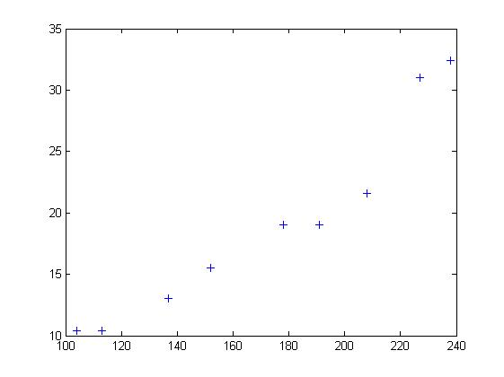
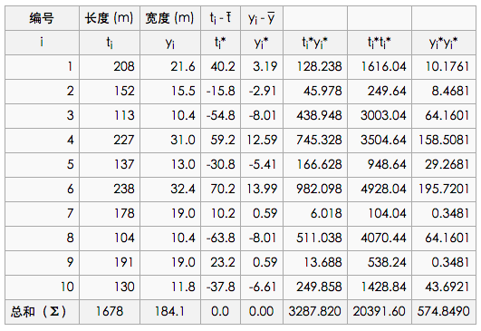
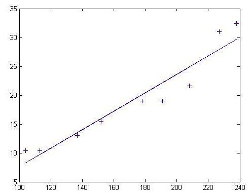
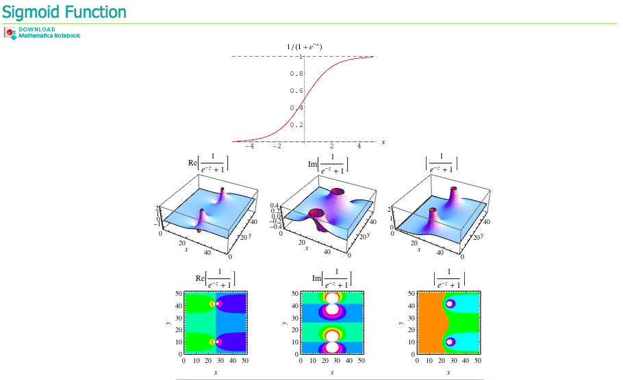

=============================
第四章 数据抓取与机器学习算法
=============================

在开始这一章之前，你可能需要补习一下数学知识；还有熟悉下常见工具（语言），不必多年开发经验，会处理常见数据结构、能格式化文件即可。

建议先通读一下 `Scrapy 中文文档 <http://scrapy-chs.readthedocs.org/zh_CN/0.22/intro/overview.html>`_ ，这样你会省去好多Google的时间；在 `知乎 <http://www.zhihu.com/topic/19559424/top-answers>`_ 上有许多关于 *大数据* 、 *数据挖掘* 的讨论，你可以去看看了解一些业内的动态。

另外，可以使用 `Nutch <http://nutch.apache.org>`_ 来爬取，并用 `Solr <http://lucene.apache.org/solr/>`_ 来构建一个简单的搜索引擎，它们可以跟下一章节的Hadoop集成。 

还有一个比较重要的点-- `Model Thinking <https://www.coursera.org/course/modelthinking>`_ ，你需要的不只是建模的知识，还要有建模的思想。数据和算法并不是最重要的，重要的是你如何利用这些数据通过你设计的模型来输出对你有用的结果。

**不要以编程开始你的机器学习之旅，这样容易使思维受限于语言，从模型和结果思考去达到你的目的，编程只是手段之一。**

-------------
4.1 数据收集
-------------

数据收集是学习数据分析的开始。我们每一天

为了省去一些学习的麻烦，我找了一些 `“大”数据 <http://www.quora.com/Where-can-I-find-large-datasets-open-to-the-public>`_ ，有些上百TB的数据对非行业内的人来说可能毫无意义，但是，先来些数据吧，但是对学习者来说还是比较实用的。

简单抓取
=========

动手写一个最简单的爬虫
-----------------------

实际使用时遇到的问题
----------------------

分布式抓取
===========

scrapyd
--------

scrapy-redis
-------------

使用Nutch + Solr
-----------------

-------------
4.2 爬虫示例
-------------

58同城
=======

我简单写了一个 `收集58同城中上海出租房信息的爬虫 <https://github.com/lofyer/myspiders/tree/master/tongcheng>`_ ，包括的条目有： *描述* 、 *位置* 、 *价格* 、 *房间数* 、 *URL* 。

由于这些信息都可以在地图上表示出来，那我除了画统计图以外还会画它们在地图上的表示。

知乎
====

http://blog.javachen.com/2014/06/08/using-scrapy-to-cralw-zhihu/

http://segmentfault.com/blog/javachen/1190000000583419

https://github.com/KeithYue/Zhihu_Spider.git

新浪微博
=========

https://github.com/followyourheart/sina-weibo-crawler

---------------
4.3 numpy 快查
---------------

.. code::

    import numpy as np
    a = np.arange(1,5)
    data_type = [('name','S10'), ('height', 'float'), ('age', int)]
    values = [('Arthur', 1.8, 41), ('Lancelot', 1.9, 38), 
                ('Galahad', 1.7, 38)]
    b = np.array(values, dtype=data_type)
    c = np.arange(6,10)

    # 符号
    np.sign(a)

    # 数组最大值
    a.max()

    # 数组最小值
    a.max()

    # 区间峰峰值
    a.ptp()

    # 乘积
    a.prod()

    # 累积
    a.cumprod()

    # 平均值
    a.mean()

    # 中值
    a.median()

    # 差分
    np.diff(a)

    # 方差
    np.var(a)

    # 元素条件查找，返回index的array
    np.where(a>2)

    # 返回第2，3，5个元素的array
    np.take(a, np.array(1,2,4))

    # 排序
    np.msort(a)
    np.sort(b, kind='mergesort', order='height')

    # 均分，奇数个元素的array不可分割为偶数。
    np.split(b,2)

    # 创建单位矩阵
    np.eye(3)

    # 最小二乘，参数为[x,y,degree]，degree为多项式的最高次幂，返回值为所有次幂的系数
    np.polyfit(a,c,1)

---------------------------------
4.4 监督学习常用算法及Python实现
---------------------------------

信息分类基础
=============

信息的不稳定性为熵（entropy），而信息增益为有无样本特征对分类问题影响的大小。比如，抛硬币正反两面各有50%概率，此时不稳定性最大，熵为1；太阳明天照常升起，则是必然，此事不稳定性最小，熵为0。

假设事件X，发生概率为x，其信息期望值定义为：

.. math::

    l(X) = -log_2 x

整个信息的熵为：

.. math::

    H = -\sum^n_{i=1} log_2 x

如何找到最好的分类特征：

.. code::

    def chooseBestFeatureToSplit(dataSet):
        numFeatures = len(dataSet[0]) - 1      #the last column is used for the labels
        baseEntropy = calcShannonEnt(dataSet)
        bestInfoGain = 0.0; bestFeature = -1
        for i in range(numFeatures):        #iterate over all the features
            featList = [example[i] for example in dataSet]#create a list of all the examples of this feature
            uniqueVals = set(featList)       #get a set of unique values
            newEntropy = 0.0 
            for value in uniqueVals:
                subDataSet = splitDataSet(dataSet, i, value)
                prob = len(subDataSet)/float(len(dataSet))
                newEntropy += prob * calcShannonEnt(subDataSet)
            infoGain = baseEntropy - newEntropy     #calculate the info gain; ie reduction in entropy
            if (infoGain > bestInfoGain):       #compare this to the best gain so far
                bestInfoGain = infoGain         #if better than current best, set to best
                bestFeature = i
        return bestFeature                      #returns an integer

    其中，dataSet为所有特征向量，caclShannonEnt()计算特征向量的熵，splitDataSet()切除向量中的value列；infoGain即为信息增益，chooseBestFeatureToSplit返回最好的特征向量索引值。

K邻近算法
==========

kNN的算法模型如下：

对于未知类别属性的数据且集中的每个点依次执行以下操作：

- 计算已知类别数据集中的点与当前点之间的距离

- 按照距离递增依次排序

- 选取与当前点距离最小的k个点

- 确定前k个点所在类别的出现频率

- 返回前k个点出现频率最高的类别作为当前点的预测分类

代码参考如下：

.. code::

    def classify0(inX, dataSet, labels, k): 
        dataSetSize = dataSet.shape[0]
        diffMat = tile(inX, (dataSetSize,1)) - dataSet
        sqDiffMat = diffMat**2
        sqDistances = sqDiffMat.sum(axis=1)
        distances = sqDistances**0.5
        sortedDistIndicies = distances.argsort()    
        classCount={}    
        for i in range(k):
            voteIlabel = labels[sortedDistIndicies[i]]
            classCount[voteIlabel] = classCount.get(voteIlabel,0) + 1 
        sortedClassCount = sorted(classCount.iteritems(), key=operator.itemgetter(1), reverse=True)
        return sortedClassCount[0][0]

    其中，inX为输入向量，dataSet为数据集，labels为数据集的分类，可调。距离计算公式为d0 = ((x-x0)**2 + (y-y0)**2)**0.5。

此种算法的优点为精度高、对异常值不敏感、但缺点也比较明显，即数据量大时开支相对较大，适用于数值－标称型数据。

决策树
======

决策树即列出一系列选择，根据训练集中的大量形似（A、B、C）以及结果D的向量来预测新输入（A'、B'、C'）的结果D'。

首先创建一个决策树：

.. code::

    def createTree(dataSet,labels):
        classList = [example[-1] for example in dataSet]
        if classList.count(classList[0]) == len(classList): 
            return classList[0]     #stop splitting when all of the classes are equal
        if len(dataSet[0]) == 1:    #stop splitting when there are no more features in dataSet
            return majorityCnt(classList)
        bestFeat = chooseBestFeatureToSplit(dataSet)
        bestFeatLabel = labels[bestFeat]
        myTree = {bestFeatLabel:{}}
        del(labels[bestFeat])
        featValues = [example[bestFeat] for example in dataSet]
        uniqueVals = set(featValues)
        for value in uniqueVals:
            subLabels = labels[:]       #copy all of labels, so trees don't mess up existing labels
            myTree[bestFeatLabel][value] = createTree(splitDataSet(dataSet, bestFeat, value),subLabels)
        return myTree

    找到影响最大的特征bestFeat后，再创建此特征下的分类向量创建子树向量，然后将bestFeat分离后继续迭代，直至所有特征都转换成决策节点。

    原始数据比如：

        no-surfacing flippers  fish
    1       yes         yes     yes
    2       yes         yes     yes
    3       yes         no      no
    4       no          yes     no
    5       no          yes     no

    会生成如下决策树：

    no-surfacing?
        /    \
     no/      \yes
   fish(no)  flippers?
               / \
            no/   \yes
        fish(no)  fish(yes)

    表示成JSON格式，即python字典：

    {'no surfacing':{0:'no',1:{'flippers':{0:'no',1:'yes'}}}

    构建决策树的方法比较多，也可使用C4.5和CART算法。

接下来使用决策树进行分类：

.. code::

    def classify(inputTree,featLabels,testVec):
        firstStr = inputTree.keys()[0]
        secondDict = inputTree[firstStr]
        featIndex = featLabels.index(firstStr)
        key = testVec[featIndex]
        valueOfFeat = secondDict[key]
        if isinstance(valueOfFeat, dict): 
            classLabel = classify(valueOfFeat, featLabels, testVec)
        else: classLabel = valueOfFeat
        return classLabel

    其中，featLabels为测试的判断节点，即特征，testVec为其值，比如classify[myTree,"['no-surfacing','flippers']",:[1,1]"]，如此结果便为'no'。

使用pickle对决策树进行序列化存储：

.. code::

    def storeTree(inputTree,filename):
        import pickle
        fw = open(filename,'w')
        pickle.dump(inputTree,fw)
        fw.close()

   其中，dump可选协议为0（ASCII），1（BINARY），默认为0；读取时使用pickle.load；同样可使用dumps，loads直接对字符变量进行操作。

此种算法计算复杂度不高，对中间值缺失不敏感，但可能会产生过拟合的问题。

朴素贝叶斯
===========

贝叶斯模型是基于独立概率统计的，思想大概可以这么说：

.. code::

    总共7个石子在A、B两个桶中，A桶中有2黑2白，B桶中有2黑1白。已知条件为石子来自B桶，那么它是白色石子的概率可表示为：

        P(white|B)=P(B|white)P(white)/P(B)

    接下来，定义两个事件A、B，P(A|B)与P(B|A)相互转化的过程即为：

        P(B|A)=P(A|B)P(B)/P(A)

    而朴素贝叶斯可以这样描述：

    设x={a1,a2,...,am}为待分类项，a为x的特征属性，类别集合为C={y1,y2,...,ym}，如果P(yk|x)=max(P(y1|x),P(y2|x),...,P(yn|x))，则x属于yk。
    
    整个算法核心即是等式P(yi|x)=P(x|yi)P(yi)/P(x)。

首先构建一个分类训练函数（二元分类）：

.. code::

    def trainNB0(trainMatrix,trainCategory):
        numTrainDocs = len(trainMatrix)
        numWords = len(trainMatrix[0])
        pBad = sum(trainCategory)/float(numTrainDocs)
        p0Num = ones(numWords); p1Num = ones(numWords)      #change to ones() 
        p0Denom = 2.0; p1Denom = 2.0                        #change to 2.0
        for i in range(numTrainDocs):
            if trainCategory[i] == 1:
                p1Num += trainMatrix[i]
                p1Denom += sum(trainMatrix[i])
            else:
                p0Num += trainMatrix[i]
                p0Denom += sum(trainMatrix[i])
        p1Vect = log(p1Num/p1Denom)          #change to log()
        p0Vect = log(p0Num/p0Denom)          #change to log()
        return p0Vect,p1Vect,pBad

    其中，trainMatrix为所有训练集中的布尔向量，比如两本书A、B，其中A有两个单词x、y，B有两个单词x、z，并且A是好书（值计为0），B是烂书（值计为0），把所有单词进行排序后得向量['x','y','z']，则A的Matrix可表示为[1,1,0]，B的为[1,0,1]，所以此函数中的trainMatrix即[[1,1,0],[1,0,1]]，trainCategory为[0,1]。
    函数返回的为概率集的向量。

分类函数：

.. code::

    def classifyNB(vec2Classify, p0Vec, p1Vec, pClass1):
        p1 = sum(vec2Classify * p1Vec) + log(pClass1)    #element-wise mult
        p0 = sum(vec2Classify * p0Vec) + log(1.0 - pClass1)
        if p1 > p0:
            return 1
        else:
            return 0

    vec2Classify即为要分类的向量，形如trainMatrix，随后的三个参数为trainNB0所返回。p1、p0可以理解为期望概率值，比较两者大小即可划分。

测试用例：

.. code::

    def testingNB():
        listOPosts,listClasses = loadDataSet()
        myVocabList = createVocabList(listOPosts)
        trainMat=[]
        for postinDoc in listOPosts:
            trainMat.append(setOfWords2Vec(myVocabList, postinDoc))
        p0V,p1V,pAb = trainNB0(array(trainMat),array(listClasses))
        testEntry = ['love', 'my', 'dalmation']
        thisDoc = array(setOfWords2Vec(myVocabList, testEntry))
        print testEntry,'classified as: ',classifyNB(thisDoc,p0V,p1V,pAb)
        testEntry = ['stupid', 'garbage']
        thisDoc = array(setOfWords2Vec(myVocabList, testEntry))
        print testEntry,'classified as: ',classifyNB(thisDoc,p0V,p1V,pAb)

整体来说，朴素贝叶斯分类方法在数据较少的情况下仍然有效，但是对数据输入比较敏感。

Logistic回归
=============

在统计学中，线性回归是利用称为线性回归方程的最小二乘函数对一个或多个自变量和因变量之间关系进行建模的一种回归分析。这种函数是一个或多个称为回归系数的模型参数的线性组合。只有一个自变量的情况称为简单回归，大于一个自变量情况的叫做多元回归。（ `维基百科 <https://zh.wikipedia.org/zh-cn/%E7%B7%9A%E6%80%A7%E5%9B%9E%E6%AD%B8>`_ ）

先介绍两个重要的数学概念。

**最小二乘法则**

最小二乘法（又称最小平方法）是一种数学优化技术。它通过最小化误差的平方和寻找数据的最佳函数匹配。

利用最小二乘法可以简便地求得未知的数据，并使得这些求得的数据与实际数据之间误差的平方和为最小。

*示例1*

有四个数据点(1,6)、(2,5)、(3,7)、(4,10)，我们希望找到一条直线y=a+bx与这四个点最匹配。

.. math::

    a+1b=6

    a+2b=5

    a+3b=7

    a+4b=10

采用最小二乘法使等号两边的方差尽可能小，也就是找出这个函数的最小值：

.. math::

    S(a,b) = [6-(a+1b)]^2+[5-(a+2b)]^2+[7-(a+3b)]^2+[10-(a+4b)]^2

然后对S(a,b)求a,b的偏导数，使其为0得到：

.. math::

    \cfrac{{\partial}S}{{\partial}a} = 0 = 8a+20b-56

    \cfrac{{\partial}S}{{\partial}b} = 0 = 20a+60b-154

这样就解出：

.. math::

    a=3.5,b=1.4

所以直线y=3.5+1.4x是最佳的。

*函数表示*

.. math::

    \min_{\vec{b}}{\sum^n_{i=1}}(y_m-y_i)^2

*欧几里德表示*

.. math::

    \min_{ \vec{b} } \| \vec{y}_{m} ( \vec{b} ) - \vec{y} \|_{2} 

*线性函数模型*

典型的一类函数模型是线性函数模型。最简单的线性式是

.. math::

    y = b_0 + b_1 t
    
写成矩阵式，为

.. math::

    \min_{b_0,b_1}\left\|\begin{pmatrix}1 & t_1 \\ \vdots & \vdots \\ 1 & t_n  \end{pmatrix}\begin{pmatrix} b_0\\ b_1\end{pmatrix} - \begin{pmatrix} y_1 \\ \vdots \\ y_{n}\end{pmatrix}\right\|_{2} = \min_b\|Ab-Y\|_2

直接给出该式的参数解：

.. math::

    b_1 = \frac{\sum_{i=1}^n t_iy_i - n \cdot \bar t \bar y}{\sum_{i=1}^n t_i^2- n \cdot (\bar t)^2}
    
    b_0 = \bar y - b_1 \bar t

其中

.. math::

    \bar t = \frac{1}{n} \sum_{i=1}^n t_i
    
为t值的算术平均值。也可解得如下形式：

.. math::

    b_1 = \frac{\sum_{i=1}^n (t_i - \bar t)(y_i - \bar y)}{\sum_{i=1}^n (t_i - \bar t)^2}

*示例2*

随机选定10艘战舰，并分析它们的长度与宽度，寻找它们长度与宽度之间的关系。由下面的描点图可以直观地看出，一艘战舰的长度（t）与宽度（y）基本呈线性关系。散点图如下： 

以下图表列出了各战舰的数据，随后步骤是采用最小二乘法确定两变量间的线性关系。

仿照上面给出的例子

.. math::

    \bar t = \frac {\sum_{i=1}^n t_i}{n} = \frac {1678}{10} = 167{.}8
    
并得到相应的

.. math::
    
    \bar y = 18{.}41

然后确定b1

.. math::

    b_1 = \frac{\sum_{i=1}^n (t_i- \bar {t})(y_i - \bar y)}{\sum_{i=1}^n (t_i- \bar t)^2}

    = \frac{3287{.}820} {20391{.}60} = 0{.}1612 \;

可以看出，战舰的长度每变化1m，相对应的宽度便要变化16cm。并由下式得到常数项b0：

.. math::

    b_0 = \bar y - b_1 \bar t = 18{.}41 - 0{.}1612 \cdot 167{.}8 = -8{.}6394

可以看出点的拟合非常好，长度和宽度的相关性大约为96.03％。 利用Matlab得到拟合直线：

**Sigmoid函数**

Sigmoid函数具有单位阶跃函数的性质，公式表示为：

.. math::

    \sigma (z)=\cfrac{1}{1+e^{-z}}

我们将输入记为z，有下面的公式得出：

.. math::

    z=w_0 x_0 + w_1 x_1 + w_2 x_2 + \dots + w_n x_n

使用向量写法：

.. math::

    z=w^T x

其中向量x是分类器的输入数据，向量w就是我们要找到的最佳系数。

*基于优化方法确定回归系数*

**梯度上升/下降法**

梯度上升法/下降法的思想是：要找到函数的最大值，最好的方法是沿着该函数的梯度方向探寻，函数f(x,y)的梯度如下表示：

.. math::

    {\nabla}f(x,y)=\begin{pmatrix} \cfrac{{\partial}f(x,y)}{{\partial}x} \\ \cfrac{{\partial}f(x,y)}{{\partial}y}\end{pmatrix}

可以这样理解此算法：

    从前有一座山，一个懒人要爬山，他从山脚下的任意位置向山顶出发，并且知道等高线图的每个环上都有一个宿营点，他希望在这些宿营点之间修建一条笔直的路，并且路到两旁的宿营点的垂直距离差的平方和尽可能小。每到一个等高线圈，他都会根据他在上一个等高线的距离的变化量来调节他的在等高线上的位置，从而使公路满足要求。

返回回归系数：

.. code::

    def gradAscent(dataMatIn, classLabels):
        dataMatrix = mat(dataMatIn)             #convert to NumPy matrix
        labelMat = mat(classLabels).transpose() #convert to NumPy matrix
        m,n = shape(dataMatrix)
        alpha = 0.001
        maxCycles = 500 
        weights = ones((n,1))
        for k in range(maxCycles):              #heavy on matrix operations
            h = sigmoid(dataMatrix*weights)     #matrix mult
            error = (labelMat - h)              #vector subtraction
            weights = weights + alpha * dataMatrix.transpose()* error #matrix mult
        return weights 

    其中，误差值乘以矩阵的转秩代表梯度。

待修改。

SVM
===

SVM（Supprot Vector Machines）即支持向量机，完全理解其理论知识对数学要求较高。

AdaBoost
========

---------------
4.5 无监督学习
---------------

---------------
4.6 数据可视化
---------------

数据统计
=========

Gephi

GraphViz

python-matplotlib

Microsoft Excel 2013 PowerView

地理位置表示
=============

`百度地图API <http://developer.baidu.com/map/index.php?title=%E9%A6%96%E9%A1%B5>`_

`MaxMind GeoIP <http://dev.maxmind.com/geoip/geoip2/geolite2/>`_

Microsoft Excel 2013 PowerView使用示例

-----------------
4.7 机器学习工具
-----------------

`Weka <http://www.cs.waikato.ac.nz/>`_

`Netlogo <https://ccl.northwestern.edu/netlogo/>`_

`SciKit <http://scikit-learn.org/>`_

`Pandas <http://pandas.pydata.org/>`_
