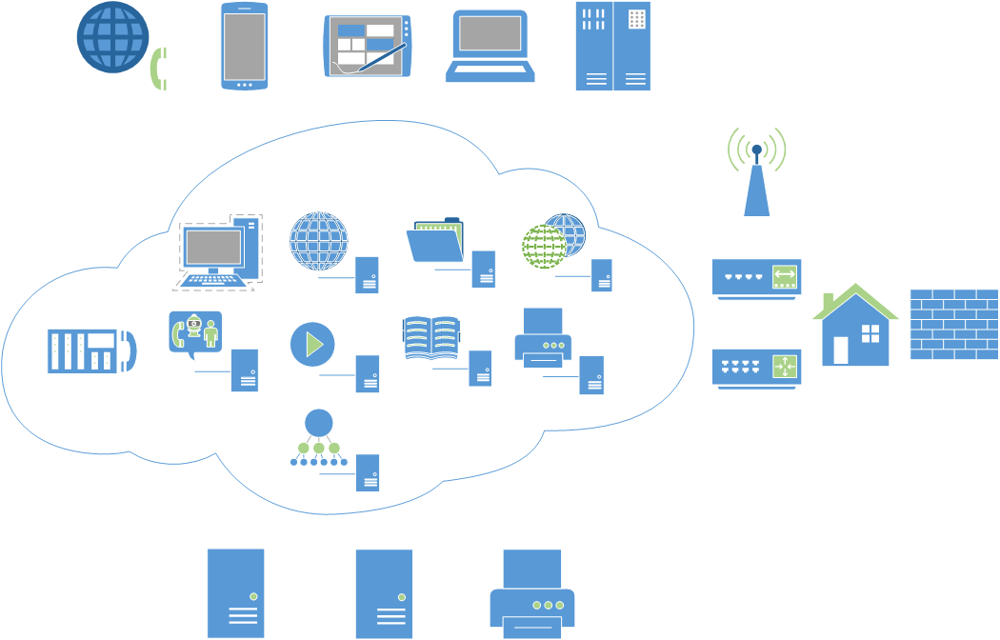

======================
实践 构建先进的家居云
======================

鉴于计算能力的摩尔定律以及家庭联网功能设备的爆发式增长，我们可以制造建立于各个家庭上的“云团”。

先进性体现在哪呢？

首先，我们的服务主要依托于虚拟化，数据流一定是SSL加密的，最大程度地与现有设备交互，服务可以对外限量使用。

系统架构
--------

架构这个东西从来就没离开过需求，那我们的需求是什么呢？

1. 你是否有过文件无处安放的苦恼，装进电脑里怕系统重装后弄丢，装进移动存储怕插坏？

2. 你是否有一些本地照片、音乐、视频要给家人分享？

3. 你是否有一些本地照片、音乐、视频要给网络上的好友分享？

4. 你是否有一些重要文档，想要的时候却总也找不到？

5. 你是不是考虑过品牌家用NAS？

6. 你是不是不放心市场上的智能家居设备，担心它们窥探隐私（后门、被入侵）？

7. 你是否觉得让现有的家庭设备智能化很容易，但是自己没时间做？

8. 你是不是炒股？你的信息来源是不是非常分散？

9. 机器太多，怎么监控？

0. OK，我在扯淡。。

OK，这些我们都可以分而治之，整个系统的骨架大概如下图所示。

构建元素
--------

硬件： **HP N54L** 、 **Raspberry Pi** 、 **Mac mini** 、 **电话语音卡** 、 **WRT54G（可选）**

服务：网络认证、XMPP即时通信（服务群成员）、云存储、家庭知识库、家庭影像库、NAS（Apple TM兼容）、数据源（微博等）、DNS（解析内部服务器）、语音电话、语音识别控制、股票分析、clamav（防病毒）、zabbix监控

软件：OpenLDAP、jabber、 、 `Seafile <https://www.seafile.com/home/>`_  、 `owncloud <http://www.owncloud.org>`_ 、 `XBMC（更名Kodi） <http://xbmc.org/>`_ 、Wiki、Asterisk、 `jasper <http://jasperproject.github.io/>`_ 、 Hadoop 、 `clamav <http://www.clamav.net/download.html>`_ 、 AirPlay(Linux/OSX Server)

.. note:: 不需要的东西

    建立一个搜索引擎就三步：下载网页、建立索引、质量排序，对的，我们不需要自己建立，主要原因就是索引量太小。有兴趣的话可以查看 http://en.wikipedia.org/wiki/List_of_search_engines ，或者使用Nutch、Lucene或者Sphinx来搭建自己的搜索引擎。

OS X Server
------------

鉴于OS X Server安装服务非常方便，这里就针对它的常用服务进行讲解。

- Time Machine： 给Mac机器提供时光机器服务，可以很方便地对Mac进行备份与恢复，一定要保证磁盘划分合理。

- VPN：可以创建基于LT2P或者PPTP的VPN服务器。

- 信息：提供基于XMPP的Jabber即时消息服务。

- Wiki：可以创建博客以及Wiki服务器。

- 网站：可提供PHP或者Python的Web服务。 OS X有一个 `webpromotion <https://github.com/st3fan/osx-10.9/blob/master/apache-786/webpromotion.rb>`_ 命令，用于更改桌面配置，以优化web服务体验。

- 文件共享：可以通过Samba、AFP、Webdav方式共享文件或目录。

- FTP：提供FTP服务。

- 通讯录：可提供CardDav格式或者LDAP内的通讯录，适用于大多数移动设备。

- NetInstall：提供网络安装OS X的服务，一般用于重装或者恢复系统。

- Open Directory：提供LDAP服务，包含Kerberos认证。

- DNS：用于内部DNS服务。

.. note:: 家庭局域网DNS服务器

    家庭局域网中的DNS服务器有时还是很有必要的，可以使用RPi、MacMini（或者其他合适的路由设备）作为DNS转发，配合 `dnsmasq <http://www.thekelleys.org.uk/dnsmasq/docs/dnsmasq.conf.example>`_ 快速部署DNS。
