==================
私有云桌面网络组建
==================

本文介绍了私有云桌面中组网的基础技术及其实现方式，然后又列举了oVirt/OpenStack中关于虚拟桌面网络的组建方式。最后笔者尝试从多个方面解析典型私有云桌面中网络配置的选择，以及它们可能带来的风险及利弊。

1. 桌面云中常用网络 
====================

笔者所接触的虚拟化桌面云平台中，普遍使用libvirt组网，其实现技术可以是tagged或者untagged vlan，NAT，桥接，openvswitch等。接下来我将就使用较多的NAT网络、桥接网络和openvswitch作些详细介绍。

------------
1.1. NAT网络
------------

对于NAT（network address translation）技术，我们或许并不陌生。我们家庭路由器接入ISP提供商时，路由器会获得一个外网IP（公网IP），局域网电脑接入路由器后获得一个内网IP，我们即是从NAT后端来访问外网的。这也是NAT最广的用途之一，随着现在IPv6的流行，有人甚至认为NAT技术不如往日重要了。我们在此不讨论这个话题，只介绍一下NAT技术的在虚拟化中的常见应用场景。

.. figure:: ../images/nat1.png
    :align: center

    图1-1 NAT通用实现

内部地址（iAddr:port1）映射到外部地址（eAddr:port2），所有从iAddr:port1的包都经由eAddr:port2向外发送。所有外部主机都能通过eAddr:port2向内部主机的iAddr:port1发送数据，有些实现中，要求必须内部主机先向外部主机发送数据才能允许外部发送至内部。

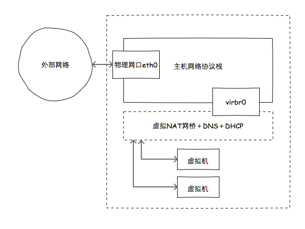

    图1-2 libvirt NAT示例

.. code::

    <network>
      <name>default</name>
      <bridge name="virbr0" />
      <forward mode="nat"/>
      <domain name="example.com"/>
      <dns>
        <txt name="example" value="example value" />
        <forwarder addr="8.8.8.8"/>
        <forwarder addr="8.8.4.4"/>
        <srv service='name' protocol='tcp' domain='test-domain-name' target='.' port='1024' priority='10' weight='10'/>
        <host ip='192.168.122.2'>
        <hostname>myhost</hostname>
        <hostname>myhostalias</hostname>
        </host>
     </dns>
      <ip address="192.168.122.1" netmask="255.255.255.0">
        <dhcp>
          <range start="192.168.122.100" end="192.168.122.254" />
        </dhcp>
      </ip>
      <ip family="ipv6" address="2001:db8:ca2:2::1" prefix="64" />
    </network>

所有虚拟机获得的IP范围为192.168.122.100-192.168.122.254，网关为192.168.122.1，DNS为192.168.122.2，请求可转发至8.8.8.8或8.8.4.4。

在虚拟化中使用NAT的好处不言而喻，主要有以下几点：

- 解决了局域网中IP可能不足的隐患；

- 网络拓扑更具弹性；

- 客户端网络行为更易控制，比如局域网、外网访问权限；

-------------
1.2. 桥接网络
-------------

桥接即是将两个以上的网络通过设备进行连接从而达到网络汇聚的目的。桥接位于OSI模型中的物理层和链路层数据链路层。桥接技术有四种：简单桥接、多端口桥接、透明桥接和源路由巧接。在虚拟化中，我们通常使用的是多端口桥接。

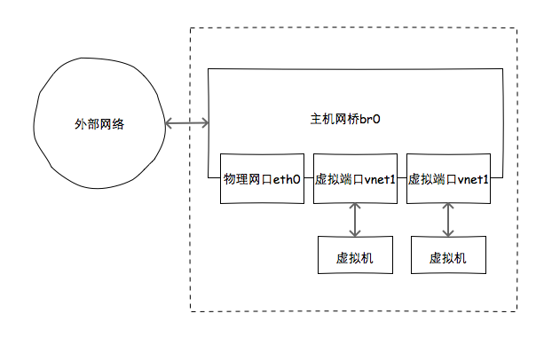

    图1-3 libvirt中的桥接示意图

为了使用桥接网络，我们首先需要配置桥接口，此处笔者以RHEL操作系统示例。配置br0为桥接口，其中一个port为物理接口eth0。

.. code::

    /etc/sysconfig/network-scripts/ifcfg-br0

    DEVICE=br0
    TYPE=Bridge
    BOOTPROTO=none
    ONBOOT=yes
    DEFROUTE=yes
    IPADDR=192.168.0.100
    NETMASK=255.255.255.0
    GATEWAY=192.168.0.254
    DNS1=8.8.8.8
    DNS2=8.8.4.4

    /etc/sysconfig/network-scripts/ifcfg-eth0

    DEVICE=eth0
    ONBOOT=yes
    BRIDGE=br0

我们通过VirtManager启动虚拟机后可看到如下内容。其中br0是刚刚创建的桥，eth0和vnet0是桥中的两个接口。

.. code::

    [root@localhost ~]# brctl show
    bridge name     bridge id           STP enabled interfaces
    br0             8000.000c2958db65   no          eth0
                                                    vnet0

-----------------
1.3. Open vSwitch
-----------------

Open vSwitch（下面简称为 OVS）是由 Nicira Networks 主导的，运行在虚拟化平台（ KVM，Xen）上的虚拟交换机。在虚拟化平台上，OVS可以为动态变化的端点提供2层交换功能，从而很好地控制虚拟网络中的访问策略、网络隔离、流量监控等。OVS 遵循Apache 2.0许可证, 能同时支持多种标准的管理接口和协议。OVS也提供了对OpenFlow协议的支持，用户可以使用任何支持OpenFlow协议的控制器对OVS进行远程管理控制。

在OVS中, 有几个非常重要的概念：

- Bridge：Bridge代表一个虚拟交换机（Switch），一个主机中可以创建一个或者多个Bridge设备。

- Port：端口与物理交换机的端口概念类似，每个Port都隶属于一个Bridge。

- Interface：连接到Port的网络接口设备。在通常情况下，Port和Interface是一对一的关系, 只有在配置Port为bond模式后，Port和Interface是一对多的关系。

- Controller：OpenFlow控制器。OVS可以同时接受一个或者多个OpenFlow控制器的管理。

- Datapath：在 OVS 中，datapath负责执行数据交换，也就是把从接收端口收到的数据包在流表中进行匹配，并执行匹配到的动作。

- Flow Table：每个 datapath 都和一个flow table关联，当datapath接收到数据之后，OVS会在flow table中查找可以匹配的flow，执行对应的操作, 例如转发数据到其他指定端口。

一般在虚拟化平台中，使用OVS时多数会配合局域网的VLAN以便于管理。在流量较小的网络环境中，使用其GRE网络用于多虚拟机互联的场景也很常见。

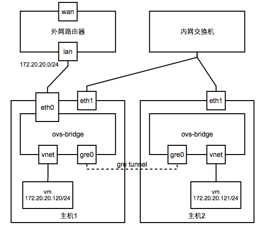

    图1-4 OVS使用GRE联通虚拟机网络示意图

在libvirt中使用OVS网络时，需要进行如下定义。

.. code::

    # cat ovs-br0.xml
    <network>
      <name>ovs-net</name>
      <forward mode='bridge'/>
      <bridge name='ovs-br0' />
      <virtualport type='openvswitch'/>
    </network>

    # virsh define ovs-br0.xml
    # virsh start ovs-br0

2. oVirt/OpenStack的桌面网络应用
================================

oVirt的虚拟机网络默认使用桥接，而OpenStack可以选配使用桥接、OVS等作为后端。笔者将以oVirt为主，OpenStack网络为辅，介绍一些典型的桌面云网络配置场景。

-----------------------------
2.1. oVirt/OpenStack组网方式
-----------------------------

oVirt/OpenStack中的组网方式都以上一章节中的三种组网为基础，搭配VLAN（tagged、untagged）进行组合。我们在此不涉及网络应用（CDN、Load Balance、Firewall），仅仅就虚拟桌面中的组网方式选择进行讨论。

2.1.1. OpenStack典型组网  
------------------------

OpenStack的组网后端有Linux Bridge和OpenvSwitch两种，在绝大多数的实施中我们一般都会使用VLAN配合组网。

**Linux Bridge组网**

使用Linux Bridge作为Neutron后端时，网络节点会使用诸如ip、dnsmasq、iptables、brctl等命令完成二三层功能。每一个接口与桥的信息都会以元数据形式保留在数据库中。

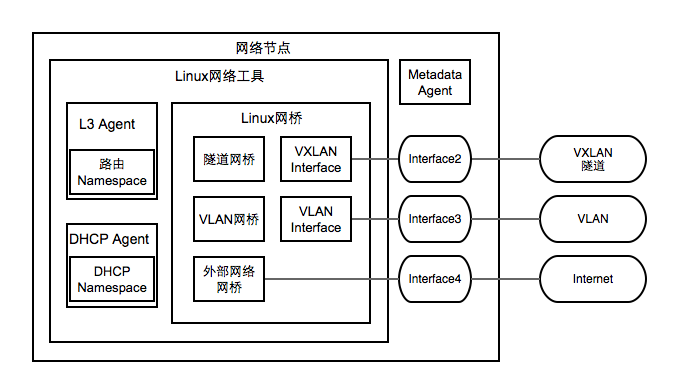

    图2-1 Linux Bridge网络节点概图

然后实例与划分出的各种接口接驳，这些接口经过Linux Bridge Agent的部署后，再与网络节点相连。

.. figure:: ../images/lb-compute.png
    :align: center

    图2-2 Linux Bridge计算节点概图

下图是典型的实例运行时网络拓扑。

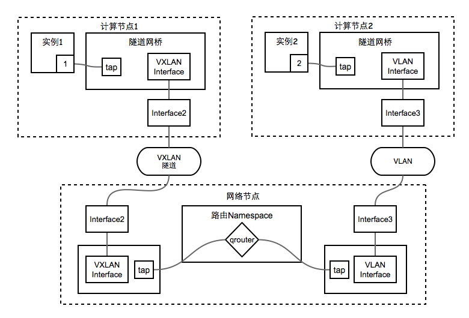

    图2-3 Linux Bridge组网拓扑

**OVS组网**

使用Linux Bridge作为Neutron后端时，网络节点会使用OVS命令完成所有三层、DHCP、交换功能，同时这些信息也会保留在元数据中。

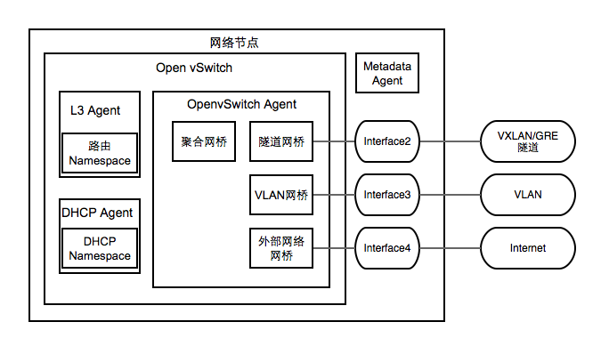

    图2-4 OVS网络节点概图

实例在通信时，数据包经过管道、VLAN标签处理，然后经网络节点FlowTable控制，最终数据得以传输。

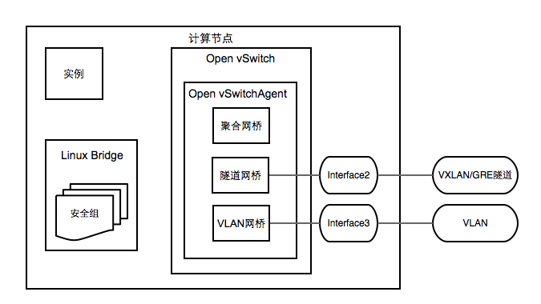

    图2-5 OVS计算节点概图

下图是使用固定IP的实例网络拓扑。

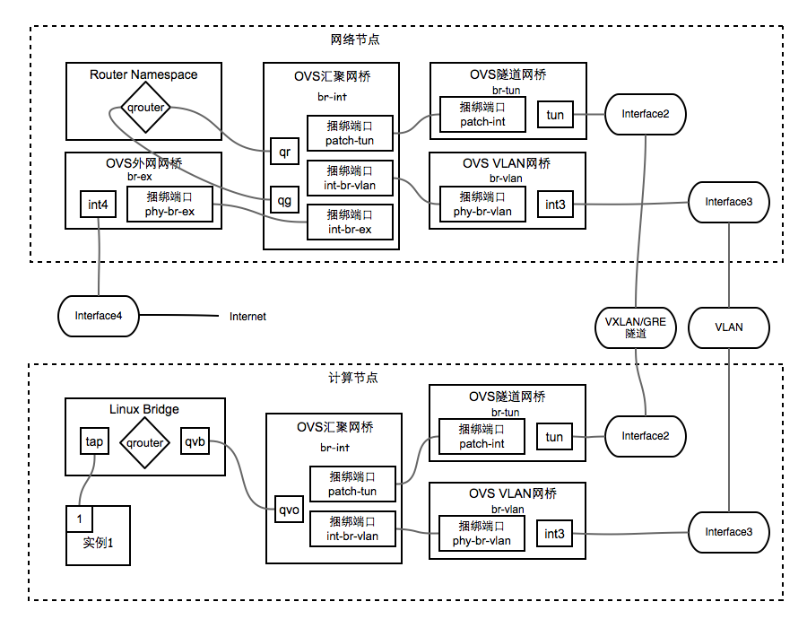

    图2-6 固定IP实例OVS网络拓扑

2.1.2. oVirt默认组网方式
------------------------

oVirt的管理界面中我们可以很方便地拖动网络标签并将之与物理网口绑定，并且物理网口之间可以进行多种模式的bonding，然后每一个网络标签都可以配置IP信息、VLAN信息。当网络设置完成并附加到虚拟机以后，所有虚拟机网口都会与标签的网络进行桥接（可以选择保留或者剥离VLAN信息）。

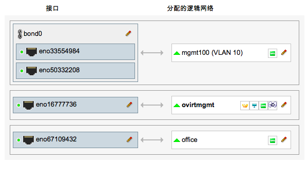
    
    图2-7 oVirt管理界面设置网络

oVirt也可以使用OpenStack Neutron的网络，从而弥补了oVirt网络虚拟化的不足。

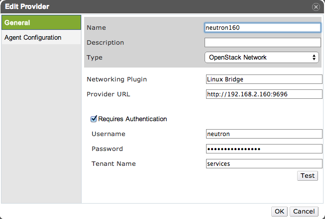

    图2-8 oVirt管理界面添加Neutron网络 - 配置Tenant

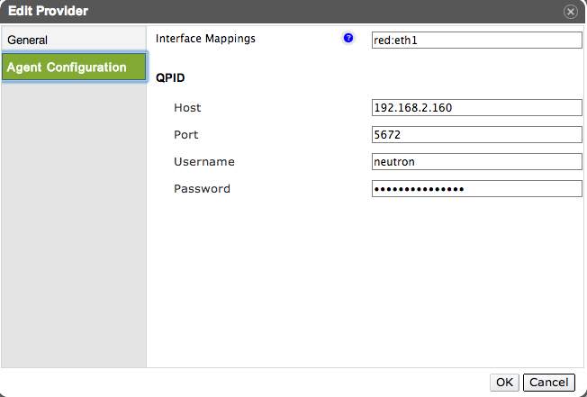

    图2-9 oVirt管理界面添加Neutron网络 - 配置MQ

除OpenStack Neutron外，oVirt可以使用的外部服务有OpenStack Glance、Foreman、Docker等。从其默认的ovirt-image-repository外部Glance源中我们可以导入Neutron实例到本地，然后很方便地搭建OpenStack Neutron网络而不需要完整的OpenStack环境。

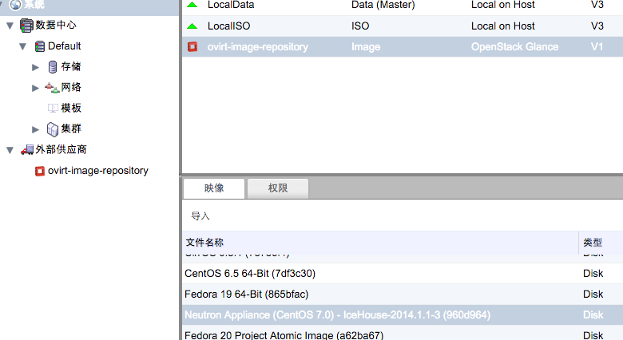

    图2-10 oVirt中导入Neutron实例

-------------
2.2. 场景细分
-------------

2.2.1. 教学机房
----------------

教学机房内的不管是软件还是硬件，向来是各厂商的“兵家必争之所”。首先，它具有一定的规模，能够创造很好的利润；其次，它所面向的群体主要是学生，他们在工作后很有可能会不自觉地帮助推广这些产品。

接下来我们以教学机房桌面为例分析一下使用哪种网络最具优势。

一般机房教学桌面，有安装软件繁多、使用时间固定、并发量大等特点，比较考验虚拟化产品的综合素质。桌面安装软件除日常办公软件外，也包括各种文字、图形密集类教学软件，同时也可能会安装影音广播教学类软件。无特殊要求外，很少安装杀毒软件。

接下来我们从需求出发，对所有组网方式进行筛选：

- 学生、教师的桌面，要求可以连接网络，可以控制外网访问。以上几种组网方式都可以做到，那么我们根据最小环境IP资源占用原则，尽量减少桥接网络的使用；

- 教学机房网络管理人员对虚拟化平台进行管理时，他们在虚拟桌面中更倾向于分配简单的NAT网络网段，从而减少拓扑的整体复杂性。

- 对于纯软件方式的多媒体广播教学环境，当教师进行广播时，教师端编码往往在具有硬件显卡的物理机上才高效，此时教师端机器需要与学生机在同一网段，那么NAT或者OVS组网要求就对现有环境提出了更高要求（比如双网卡、服务器交换机额外VLAN）。一般这种环境下，使用桥接网络更合适。

以上即是笔者对教学机房虚拟桌面内组网方式对建议，读着应根据实际环境做出判断，在工作量与性能、功能间作出取舍。

2.2.2. 办公桌面
---------------

面向办公的桌面，一般需求为Mircosoft Office、邮件处理等文字密集型软件；通信类软件一般为国内厂商开发的非广域网通信软件以及QQ；防病毒软件种类比较多，目前卡巴斯基、诺顿等占 多，360使用较少；影音类软件使用局限于网页flash，或者国内厂商定制的流媒体客户端。对于财务桌面，需求除普通办公桌面外也有一些财务类软件，而这些软件对桌面负荷较普通办公桌面会高出一定量的资源消耗，同时也会有U-Key、指纹 仪等终端设备，所以对于这类桌面，我们一般进行特殊设置，比如将其固定到某台服务器上运行，并赋予一定优先级，保证资源优先分配。在普通桌面与财务桌面以外，也有浮动桌面可供出差人员或者来访人员临时使用，此种桌面与一般办公桌面无异，但可能要求有严格的用户检查控制以及无状态模式要求，防止恶意使用导致损失。

以上即是办公桌面的典型场景了，那么我们的组网方式也基本明确了。一般桌面使用OVS或者NAT皆，优先考虑OVS；浮动桌面则使用NAT；对于财务这类有特殊需求的桌面我们也可考虑使用桥接网络。另外当办公室中有类似打印机、扫描仪、指纹仪等共享设备时，它们的组网以桥接方式优先，这样便保证了所有人员都能对其进行访问。

3. 总结
========

在平时的实施中，我们可以将组网按照资源稀缺性依次排列出桥接>OVS>NAT；同时按照一般相对访问范围排序桥接>=OVS>NAT。对于使用频率较高的私有云而言，我们根据客户运维水平、实施改造难度，并结合现场环境和特殊需求进行综合考虑，方可得到比较满意的组网规划。
