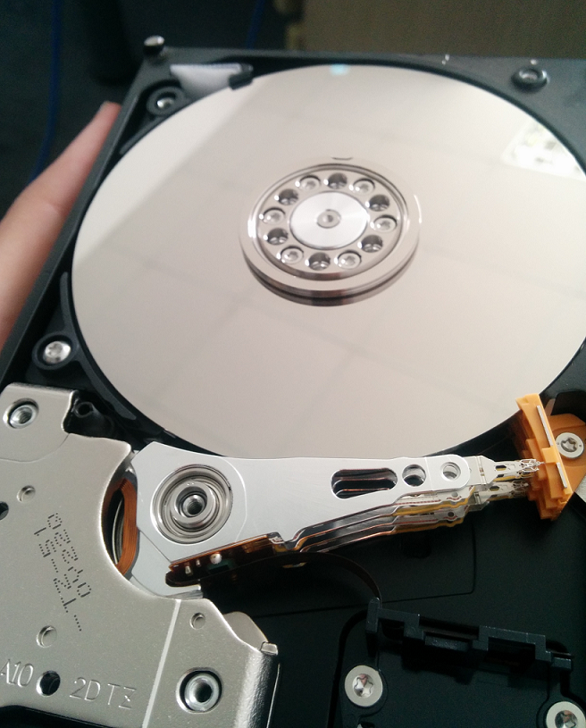

========
第一章
========

1.1 我所看到的
-------------------

从07年那会儿，甚至更早，拥有千万用户（包括盗版受害者在内）的行业先锋VMware，又有Google数据中心以及Amazon各种在线服务，这些实打实的东西遵循计算能力的摩尔定律，再顺应日益增长的商业需求，就有了“云”和“大数据”这两个让许多企业再次躁动的概念。

稍微有些行业经验（至少以为是或者看来是）的人觉得这俩只是个噱头；搞大型机的说，嗯，这个，呵呵；搞IDC的觉得一台机器现在当二十台甚至更多卖，不错；搞互联网服务的就有些挠头，咦，这啥？噢，就那玩意儿啊，干嘛起这名？

不管大家都怎么看吧，先引用一句关于“大数据”的经典：

*“Big Data is like teenage sex: everyone talks about it, nobody really knows how to do it, everyone thinks everyone else is doing it, so everyone claims they are doing it.”*

有时，你我或许都会有迷惘，我这么做（说），对么？

那就这样，**但行好事，莫问前程**。

作为公司的一名小小员工，从客户交流到现场部署、从SDN交换机到Neutron、从QEMU到IAAS，我都有过了解或接触，并将其记录成文，是总结，亦是探索。期间难免会有这样或者那样的想法，而将这些想法实践出来的过程是会让人觉得生活依旧是美好的。

接下来是以我目前水平能看到的：

- 和多数行业一样，不管哪个公司，他们技术和关系，在不同客户那里都有不同的权重，这点的南北差异尤为明显；

- 风（宏观调控）让云去哪，云就去哪；

- AppEngine或者OpenShift目前更像是资源（公共数据中心）一厢情愿的产物；

- 以我所遇到的客户来看，部分客户不会明确的说使用“云”，他们的需求在多数情况下可以有这样或者那样的传统方案替代；明确要求使用“云”的客户，总会要求周边指标（用户接入、终端协议、视频流占用带宽、UPS、存储复用等）以及各种各样的定制。

所以，在需求上的灵活变通，也是有些许重要性的，**不要把技术人员的固执带到客户那**。

1.2 今天天气怎样
----------------

7:50 手机闹铃响了，随之而来的是你订阅的RSS、Flipboard推送的新闻。随手翻阅下，完后Siri说今天天气挺暖和的，可以穿你最喜欢的高领毛衣，起床。

8:30 高速公路上，地图告诉你前方拥堵，正好这时领导打来电话，你告诉Siri说“接听”。挂了电话以后，红灯亮了，汽车记录下你这次堵车的时间，并默默再次计算预计到时。

9:20 到达公司门口，没有保安，取而代之的是连接公司LDAP服务器的瞳孔识别。

10:00 收到信息，来自楼下快件派发柜，你订购的球鞋到了。

10:30 客户预约的拜访，你告诉Siri说把公司地址导航路线发送给客户张三。

11:10 通过公司IM告诉前台临时允许车牌号为K9031的车辆进来并发送车位信息给客户。

11:20 和客户在临时会客厅谈话，期间你把演说内容通过手势（食指一划）推送到客户邮箱，他们感到很意外（加分点）。

12:30 午餐时间，Siri还记得你在决心减肥期间，提醒你不要吃最喜欢的红烧肉，末了来一句“两个人被老虎追，谁最危险？Bingo，胖的那个”。

14:30 有客户如约送来了10T的财务数据，你通知技术部小李对这些数据进行方案II处理，百分之30的处理任务交给武汉机房的机器，因为这些从机柜到主板都是你依照节能环保的原则主持设计的。

16:00 Siri告诉你，抱歉，六点钟有局部降雨。

17:00 你把今天的备忘录存进公司派发给你的虚拟桌面，下班。

19:00 老婆大人的晚饭做好了，你也再次连上虚拟桌面把备忘录整理归档。

20:30 跑步结束，它告诉你这几周换季期间，要增加运动量，你说“可以”。

23:00 休息，Siri通过文字悄悄告诉你，明天结婚纪念日，记住。

**所有已知未知的暗流，让人有了继续折腾下去的欲望。**

我是一个着重实践的人，是的，比如磁盘不拆开的话我可能就对扇区、磁道、柱面没什么深刻概念（其实拆了也没多深刻）。所以，这一些列文章将尽量从操作或者现象中总结规律。一些原理性的东西会尽量用我觉得容易理解的形式表现出来。

整本“书”的结构将会是这个样子：

介绍下主流“云”的现状，会引用许多现成（尽量）客观的信息片段；畅想一下；从中选择部分组成一个完整系统，进行搭建（或模拟）并本地调优（避免过早优化）；避免烂尾，结尾送两首短诗吧。

1.3 根据需求来架构
--------------------------
